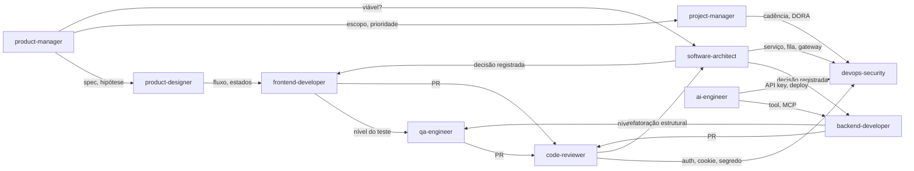

# Agents — Índice

Agentes são **papéis**: cada um recebe uma tarefa em contexto próprio, carrega as skills e as notas que aquele papel usa, e devolve um resultado no formato que o papel produz. Eles **não** repetem regra nem procedimento — roteiam para [Skills](../skills/README.md) (procedimento) e para a [knowledge-base](../knowledge-base/MANIFESTO.md) (regra), citando por ID onde houver.

A relação com as outras pastas é uma cadeia, e cada elo tem dono:

| Camada | Pasta | Responde | Exemplo |
| --- | --- | --- | --- |
| **papel** | `agents/` | *quem* faz, com que contexto, e o que entrega | `code-reviewer` |
| **procedimento** | `skills/` | *como* fazer, em que ordem, e como reportar | `react-review` |
| **regra** | `knowledge-base/` | *o que* é certo, por ID | [React - Rules of React](../knowledge-base/react-rules-of-react.md) `REACT-*` |

São três elos, não quatro: a camada de raciocínio foi cortada em 2026-09-22 e não se cita mais. `commands/` fica ao lado, como quarto **tipo de artefato**, não como camada: um comando é roteiro fixo que a pessoa invoca, e um agente é papel que decide o que carregar. Divergência entre agente e skill é bug do agente; entre skill e nota, bug da skill ([Skills](../skills/README.md)).

**Superfície de API não mora aqui.** Assinatura, opção e comportamento por versão de uma biblioteca resolvem pelo Context7, com o library ID que a skill declara em `docs:`. A knowledge-base responde o que é certo e com que ID citar num review — não o que a função aceita nesta minor.

## Os onze agentes

| Agente | Papel | Skills que carrega | Fontes principais |
| --- | --- | --- | --- |
| `code-reviewer` | Revisa PR ou arquivo já escrito em contexto fresco: roteia por família, classifica severidade, cita ID e arquivo:linha, separa achado de opinião | `react-review` · `http-review` · `drizzle-review` · `playwright-review` · `bun-test-review` · `test-review` | `Code Review` · [Claude Code - Sessão e Verificação](../knowledge-base/claude-code-sessao-e-verificacao.md) |
| `frontend-developer` | Escreve React no stack da casa: onde mora → quem é dono do estado → qual API | `react-structure` · `react-developer` · `tanstack-router` · `tanstack-query` · `react-hook-form` · `storybook-story` | [Frontend roadmap](../knowledge-base/frontend-roadmap.md) · [Architecture in React](../knowledge-base/architecture-in-react.md) · [Feature-Based Architecture](../knowledge-base/feature-based-architecture.md) |
| `backend-developer` | Escreve serviços em Bun + Elysia/Hono + Drizzle: contrato HTTP antes do handler | `elysia-build` · `elysia-schema` · `elysia-diagnose` · `http-contract` · `http-cache` · `http-diagnose` · `bun-runtime` · `bun-workspace` · `bun-migrate` · `bun-test-build` | [Backend no runtime Bun](../knowledge-base/backend-no-runtime-bun.md) · [Elysia](../knowledge-base/elysia.md) · [HTTP](../knowledge-base/http.md) · [Drizzle ORM](../knowledge-base/drizzle-orm.md) |
| `qa-engineer` | Decide o nível do teste, escreve na ferramenta, audita e diagnostica a suíte | `test-design` · `test-review` · `test-diagnose` · `playwright-build` · `playwright-review` · `playwright-diagnose` · `bun-test-build` · `bun-test-review` · `storybook-test` | [Teste de Software](../knowledge-base/teste-de-software.md) · [Playwright](../knowledge-base/playwright.md) · [Bun - Testes](../knowledge-base/bun-testes.md) |
| `software-architect` | Decide fronteiras e responsabilidades; registra a decisão com eixo, invariantes e migração | `react-structure` | [Architecture in React](../knowledge-base/architecture-in-react.md) · [Fronteira do BFF - forma, jornada e regra](../knowledge-base/fronteira-do-bff-forma-jornada-e-regra.md) · mapas de Arquitetura, Design Patterns e Microsserviços |
| `devops-security` | Pipeline, deploy, segredos, sessão, tokens, autorização | `bun-workspace` · `bun-migrate` | `Secret Management em DevOps - Mapa de Fundamentos` · [Trunk-based development](../knowledge-base/trunk-based-development.md) · [OWASP - Sessão e Autorização](../knowledge-base/owasp-sessao-e-autorizacao.md) |
| `ai-engineer` | Agentes, ferramentas, MCP, multiagentes, RAG e busca semântica; configura o Claude Code; cria skills e agentes deste projeto | — | mapas de Agentes de IA, MCP, Multiagentes, RAG e Busca semântica · [Claude Code](../knowledge-base/claude-code.md) |
| `product-manager` | Problema, hipótese, discovery, priorização, métricas, spec, decisão registrada | — | `Produto e Inovação - Mapa de Fundamentos` · `Curso de Product Management (PM3) — Mapa` |
| `product-designer` | Persona, jornada, fluxo, os quatro estados de toda tela, componentes e nível do catálogo | — | `Product Design` · `Product Team` · [Storybook estruturado por Atomic Design](../knowledge-base/storybook-estruturado-por-atomic-design.md) |
| `project-manager` | Escopo, cronograma, custo, risco, comunicação e mudança como um sistema | — | `Gestão de Projetos - Mapa de Fundamentos` |
| `monorepo-auditor` | Audita as camadas de um monorepo já escrito: direção de dependência, superfície pública, quem abre transação, qual fronteira é verificável | `bun-workspace` · `drizzle-review` · `react-structure` | [Monorepo com Bun - estrutura e tooling](../knowledge-base/monorepo-com-bun-estrutura-e-tooling.md) `MONO-*` · [Architecture in React](../knowledge-base/architecture-in-react.md) · [Fronteira do BFF - forma, jornada e regra](../knowledge-base/fronteira-do-bff-forma-jornada-e-regra.md) |

## Anatomia comum

Os dez têm a mesma forma, conferível por script, e ela estende a anatomia de [Skills](../skills/README.md) com os campos que um subagente do Claude Code lê ([Claude Code - Configuração do Repositório](../knowledge-base/claude-code-configuracao-do-repositorio.md) § 7):

| Elemento | Regra |
| --- | --- |
| `name` | kebab-case, **igual** ao nome do arquivo |
| `description` | **o quê** + **quando usar** + **quando não usar**, nomeando o agente vizinho — é por ela que o agente líder escolhe delegar |
| `tools` | o mínimo que o papel usa: agentes que decidem e revisam **não** têm `Write`/`Edit` |
| `model` | `opus` por padrão; trocar para `haiku` em tarefa simples é a economia mais direta em subagente |
| `skills` | skills **pré-carregadas por inteiro** no launch — só as que o papel usa em toda tarefa; as ocasionais ficam no carregamento mínimo do corpo |
| `fontes:` | as notas normativas ou mapas que o agente carrega primeiro |
| **instrução crítica no topo** | primeiro bloco do corpo, porque o truncamento pós-compactação preserva o início (`CC-CTX-07`) |
| `## Quando usar` | tabela de desvio para o agente ou skill certo |
| `## Passo 1 — Carregar contexto` | ordem de leitura, e o que **nunca** carregar (aulas inteiras) |
| passos de procedimento | roteiam para a skill; onde não há skill, para a nota normativa |
| formato de saída + autoverificação | o que o agente entrega e como prova (`CC-SES-01`) |
| `## Exemplo` | um caso trabalhado, com os IDs reais |
| `## Relacionados` | os vizinhos e as fontes |

## Desambiguação — a pergunta decide o agente

| A pergunta é… | Agente | Explicitamente **não** é |
| --- | --- | --- |
| este código **que já existe** está correto? aprova ou bloqueia? | `code-reviewer` | quem escreve |
| escrever componente, Hook, rota do router, query, formulário, story | `frontend-developer` | `code-reviewer` · `qa-engineer` |
| escrever rota HTTP, handler, schema, plugin, migration, workspace Bun | `backend-developer` | `software-architect` · `devops-security` |
| **que teste**, em que nível; escrever, auditar ou diagnosticar teste ou suíte | `qa-engineer` | quem escreve a feature |
| onde isto mora; vale separar; qual padrão; monolito ou serviços; BFF × backend | `software-architect` | quem implementa |
| CI, deploy, Dockerfile, segredo, cookie, JWT, OAuth, RBAC | `devops-security` | `backend-developer` escreve o handler |
| agente, tool, MCP, multiagente, RAG, embeddings, CLAUDE.md, skill nova | `ai-engineer` | `backend-developer` · `devops-security` |
| vale construir; o que priorizar; como medir; spec; hipótese | `product-manager` | `product-designer` · `project-manager` |
| como deve funcionar para o usuário; fluxo; estados da tela; usável, acessível | `product-designer` | `product-manager` · `frontend-developer` |
| quanto tempo; quem faz o quê; risco; cabe no escopo; status | `project-manager` | `product-manager` · `software-architect` |

Dois eixos separam a maior parte dos pares. **Novo × já existe** separa os que escrevem do `code-reviewer` — o mesmo eixo de [Skills](../skills/README.md). **Decide × executa** separa `software-architect`, `product-manager`, `product-designer` e `project-manager` dos três que escrevem código: os quatro que decidem não têm `Write`/`Edit` sobre o repositório e entregam decisão registrada; os que executam recebem a decisão e devolvem código com evidência.

## Como os agentes passam o bastão

Cada agente declara no passo final para quem passa o bastão, e a seta é sempre acompanhada de um artefato: spec, decisão registrada, fluxo com estados, código com evidência, relatório de achados.

## Uso no Claude Code

**Instalação.** Nada aqui é instalado à mão. `bash build/claude-code.sh` monta os plugins em `dist/claude-code/`, traduzindo o frontmatter neutro para o formato do alvo (`nome`→`name`, `capacidades`→`tools`, `modelo`→`model`) e reescrevendo os links para dentro do pacote. É o mesmo modelo de [Skills](../skills/README.md): **`agents/` é a fonte; `dist/` é o pacote.** Mudar um agente é editar aqui e rodar o build.

**O que um subagente carrega no startup** ([Claude Code - Configuração do Repositório](../knowledge-base/claude-code-configuracao-do-repositorio.md) § 7): o system prompt **dele** (o corpo da nota), o conteúdo integral das skills do campo `skills:`, o CLAUDE.md do repositório, e o que o agente líder passar no prompt. As leituras dele **não entram** no contexto principal (`CC-PAR-01`) — é por isso que revisar, investigar e auditar são tarefas de subagente por natureza.

**Invocar.** *"use o code-reviewer neste diff"*, *"peça ao software-architect para decidir onde mora a validação de CPF"*. O agente líder também delega sozinho quando a `description` casa com a tarefa — daí a `description` carregar **quando não usar** e nomear o vizinho.

**Revisão em contexto fresco.** `code-reviewer` deve receber **só o diff e o critério**, nunca a conversa que produziu a mudança (`CC-SES-07`), e o prompt deve delimitar o que conta como achado (`CC-SES-10`). Fan-out de vários revisores homogêneos (mesmo modelo, effort e ferramentas) compartilha cache ([Claude Code - Paralelismo e Escala](../knowledge-base/claude-code-paralelismo-e-escala.md)).

## O que estas notas são

Criadas em 2026-09-01 a partir do material já existente, e extraídas para este repositório em 2026-09-22: as 28 skills, as estruturas conduzidas e as decisões desta casa, hoje em `knowledge-base/`. Nenhum agente afirma regra que não esteja numa nota daqui; onde a nota marca algo como não verificado, o agente declara a limitação em vez de opinar. Citação em code span é nota que **não** veio para o projeto — e continua sendo uma citação por nome, não um caminho.

**Lacunas herdadas, declaradas.** Não há skill de construção para Drizzle nem para Hono — `backend-developer` lê o hub direto e revisa com `drizzle-review`. O cluster de OAuth, sessão e RBAC não tem skill — `devops-security` usa o checklist de [OWASP - Sessão e Autorização](../knowledge-base/owasp-sessao-e-autorizacao.md) item a item. Os agentes de produto e gestão derivam de mapas de curso que **não** foram extraídos para cá: aparecem em code span, por nome. Eles não têm regra com ID para citar, e isso é declarado, não disfarçado.

**Critério para um agente novo.** Um papel que alguém de fato exerce, com pergunta que nenhum dos onze responde, e material na knowledge-base para responder. Agente sem nota-fonte é opinião empacotada — não entra.

## Relacionados

- [Skills](../skills/README.md) — índice das skills, anatomia comum e desambiguação
- `Docs` — índice das estruturas de documentação e "Quais estruturas têm skill"
- [Claude Code - Configuração do Repositório](../knowledge-base/claude-code-configuracao-do-repositorio.md) — § 7, subagentes customizados
- [Claude Code - Paralelismo e Escala](../knowledge-base/claude-code-paralelismo-e-escala.md) — subagentes, fan-out, cache compartilhado
- ·
- `Sistemas Multiagentes - Mapa de Fundamentos` — supervisor e especialistas: a mesma ideia, em LangGraph
