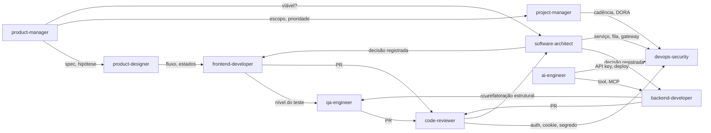

---
tags:
  - agent
  - index
---
# Agents — Índice

Agentes são **papéis**: cada um recebe uma tarefa em contexto próprio, carrega as skills e as notas do vault que aquele papel usa, e devolve um resultado no formato que o papel produz. Eles **não** repetem regra nem procedimento — roteiam para [[Skills/README|Skill]] (procedimento) e para `Docs/`, `Pages/`, `Zettels/` e os mapas de `Classroom/` (conteúdo), citando por ID onde houver.

A relação com as outras pastas é uma cadeia, e cada elo tem dono:

| Camada | Pasta | Responde | Exemplo |
| --- | --- | --- | --- |
| **papel** | `Agents/` | *quem* faz, com que contexto, e o que entrega | [[code-reviewer]] |
| **procedimento** | `Skill/` | *como* fazer, em que ordem, e como reportar | [[react-review]] |
| **regra** | `Docs/`, `Pages/` | *o que* é certo, por ID | [[React - Rules of React]] `REACT-*` |
| **raciocínio** | `Zettels/`, mapas de `Classroom/` | *por que* | [[Estado derivado no render]] |

Divergência entre agente e skill é bug do agente; entre skill e doc, bug da skill ([[Skills/README|Skill]]). Um agente nunca carrega a aula inteira de `Classroom/` quando o mapa de fundamentos e os Zettels existem — é a regra de [[Como usar a base de conhecimento para dar contexto a agentes]].

## Os dez agentes

| Agente | Papel | Skills que carrega | Fontes principais |
| --- | --- | --- | --- |
| [[code-reviewer]] | Revisa PR ou arquivo já escrito em contexto fresco: roteia por família, classifica severidade, cita ID e arquivo:linha, separa achado de opinião | [[react-review]] · [[http-review]] · [[drizzle-review]] · [[playwright-review]] · [[bun-test-review]] · [[test-review]] | [[Code Review]] · [[Claude Code - Sessão e Verificação]] |
| [[frontend-developer]] | Escreve React no stack da casa: onde mora → quem é dono do estado → qual API | [[react-structure]] · [[react-build]] · [[tanstack-router]] · [[tanstack-query]] · [[react-hook-form]] · [[storybook-story]] | [[Frontend roadmap]] · [[Architecture in React]] · [[Feature-Based Architecture]] |
| [[backend-developer]] | Escreve serviços em Bun + Elysia/Hono + Drizzle: contrato HTTP antes do handler | [[elysia-build]] · [[elysia-schema]] · [[elysia-diagnose]] · [[http-contract]] · [[http-cache]] · [[http-diagnose]] · [[bun-runtime]] · [[bun-workspace]] · [[bun-migrate]] · [[bun-test-build]] | [[Backend no runtime Bun]] · [[Elysia]] · [[HTTP]] · [[Drizzle ORM]] |
| [[qa-engineer]] | Decide o nível do teste, escreve na ferramenta, audita e diagnostica a suíte | [[test-design]] · [[test-review]] · [[test-diagnose]] · [[playwright-build]] · [[playwright-review]] · [[playwright-diagnose]] · [[bun-test-build]] · [[bun-test-review]] · [[storybook-test]] | [[Teste de Software]] · [[Playwright]] · [[Bun - Testes]] |
| [[software-architect]] | Decide fronteiras e responsabilidades; registra a decisão com eixo, invariantes e migração | [[react-structure]] | [[Architecture in React]] · [[Fronteira do BFF - forma, jornada e regra]] · mapas de Arquitetura, Design Patterns e Microsserviços |
| [[devops-security]] | Pipeline, deploy, segredos, sessão, tokens, autorização | [[bun-workspace]] · [[bun-migrate]] | [[Secret Management em DevOps - Mapa de Fundamentos]] · [[Trunk-based development]] · [[OWASP - Sessão e Autorização]] |
| [[ai-engineer]] | Agentes, ferramentas, MCP, multiagentes, RAG e busca semântica; configura o Claude Code; cria skills e agentes deste vault | — | mapas de Agentes de IA, MCP, Multiagentes, RAG e Busca semântica · [[Claude Code]] |
| [[product-manager]] | Problema, hipótese, discovery, priorização, métricas, spec, decisão registrada | — | [[Produto e Inovação - Mapa de Fundamentos]] · [[Curso de Product Management (PM3) — Mapa]] · [[Product Manager]] |
| [[product-designer]] | Persona, jornada, fluxo, os quatro estados de toda tela, componentes e nível do catálogo | — | [[Product Design]] · [[Product Team]] · [[Storybook estruturado por Atomic Design]] |
| [[project-manager]] | Escopo, cronograma, custo, risco, comunicação e mudança como um sistema | — | [[Gestão de Projetos - Mapa de Fundamentos]] · [[Gerente de projetos em tecnologia]] |

## Anatomia comum

Os dez têm a mesma forma, conferível por script, e ela estende a anatomia de [[Skills/README|Skill]] com os campos que um subagente do Claude Code lê ([[Claude Code - Configuração do Repositório]] § 7):

| Elemento | Regra |
| --- | --- |
| `name` | kebab-case, **igual** ao nome do arquivo |
| `description` | **o quê** + **quando usar** + **quando não usar**, nomeando o agente vizinho — é por ela que o agente líder escolhe delegar |
| `tools` | o mínimo que o papel usa: agentes que decidem e revisam **não** têm `Write`/`Edit` |
| `model` | `opus` por padrão; trocar para `haiku` em tarefa simples é a economia mais direta em subagente |
| `skills` | skills de `Skill/` **pré-carregadas por inteiro** no launch — só as que o papel usa em toda tarefa; as ocasionais ficam no carregamento mínimo do corpo |
| `fontes:` | as notas normativas ou mapas que o agente carrega primeiro |
| **instrução crítica no topo** | primeiro bloco do corpo, porque o truncamento pós-compactação preserva o início (`CC-CTX-07`) |
| `## Quando usar` | tabela de desvio para o agente ou skill certo |
| `## Passo 1 — Carregar contexto` | ordem de leitura, e o que **nunca** carregar (aulas inteiras) |
| passos de procedimento | roteiam para a skill; onde não há skill, para a nota normativa e os Zettels |
| formato de saída + autoverificação | o que o agente entrega e como prova (`CC-SES-01`) |
| `## Exemplo` | um caso trabalhado, com os IDs reais |
| `## Relacionados` | os vizinhos e as fontes |

## Desambiguação — a pergunta decide o agente

| A pergunta é… | Agente | Explicitamente **não** é |
| --- | --- | --- |
| este código **que já existe** está correto? aprova ou bloqueia? | [[code-reviewer]] | quem escreve |
| escrever componente, Hook, rota do router, query, formulário, story | [[frontend-developer]] | [[code-reviewer]] · [[qa-engineer]] |
| escrever rota HTTP, handler, schema, plugin, migration, workspace Bun | [[backend-developer]] | [[software-architect]] · [[devops-security]] |
| **que teste**, em que nível; escrever, auditar ou diagnosticar teste ou suíte | [[qa-engineer]] | quem escreve a feature |
| onde isto mora; vale separar; qual padrão; monolito ou serviços; BFF × backend | [[software-architect]] | quem implementa |
| CI, deploy, Dockerfile, segredo, cookie, JWT, OAuth, RBAC | [[devops-security]] | [[backend-developer]] escreve o handler |
| agente, tool, MCP, multiagente, RAG, embeddings, CLAUDE.md, skill nova | [[ai-engineer]] | [[backend-developer]] · [[devops-security]] |
| vale construir; o que priorizar; como medir; spec; hipótese | [[product-manager]] | [[product-designer]] · [[project-manager]] |
| como deve funcionar para o usuário; fluxo; estados da tela; usável, acessível | [[product-designer]] | [[product-manager]] · [[frontend-developer]] |
| quanto tempo; quem faz o quê; risco; cabe no escopo; status | [[project-manager]] | [[product-manager]] · [[software-architect]] |

Dois eixos separam a maior parte dos pares. **Novo × já existe** separa os que escrevem do [[code-reviewer]] — o mesmo eixo de [[Skills/README|Skill]]. **Decide × executa** separa [[software-architect]], [[product-manager]], [[product-designer]] e [[project-manager]] dos três que escrevem código: os quatro que decidem não têm `Write`/`Edit` sobre o repositório e entregam decisão registrada; os que executam recebem a decisão e devolvem código com evidência.

## Como os agentes passam o bastão

Cada agente declara no passo final para quem passa o bastão, e a seta é sempre acompanhada de um artefato: spec, decisão registrada, fluxo com estados, código com evidência, relatório de achados.

## Uso no Claude Code

**Instalação.** Cada nota (exceto este índice) é copiada para `~/.claude/agents/<name>.md` — ou para `.claude/agents/` do repositório, quando o papel é específico dele — com os `[[wikilinks]]` resolvidos para link markdown: para uma skill, o `SKILL.md` instalado dela em `~/.claude/skills/<nome>/SKILL.md`; para outro agente, o `.md` instalado dele; para nota de referência, o caminho absoluto da nota neste vault. É o mesmo modelo de [[Skills/README|Skill]]: **este `Agents/` é o repositório-fonte; `~/.claude/agents` é o pacote publicado.** Mudar um agente é editar aqui e reinstalar.

**O que um subagente carrega no startup** ([[Claude Code - Configuração do Repositório]] § 7): o system prompt **dele** (o corpo da nota), o conteúdo integral das skills do campo `skills:`, o CLAUDE.md do repositório, e o que o agente líder passar no prompt. As leituras dele **não entram** no contexto principal (`CC-PAR-01`) — é por isso que revisar, investigar e auditar são tarefas de subagente por natureza.

**Invocar.** *"use o code-reviewer neste diff"*, *"peça ao software-architect para decidir onde mora a validação de CPF"*. O agente líder também delega sozinho quando a `description` casa com a tarefa — daí a `description` carregar **quando não usar** e nomear o vizinho.

**Revisão em contexto fresco.** [[code-reviewer]] deve receber **só o diff e o critério**, nunca a conversa que produziu a mudança (`CC-SES-07`), e o prompt deve delimitar o que conta como achado (`CC-SES-10`). Fan-out de vários revisores homogêneos (mesmo modelo, effort e ferramentas) compartilha cache ([[Claude Code - Paralelismo e Escala]]).

## O que estas notas são

Criadas em 2026-09-01 a partir do material já existente no vault: as 28 skills de `Skill/`, as estruturas conduzidas de `Docs/`, as decisões desta casa em `Pages/`, os mapas de fundamentos de `Classroom/` e os Zettels. Nenhum agente afirma regra que não esteja numa nota do vault; onde a doc marca algo como não verificado, o agente declara a limitação em vez de opinar.

**Lacunas herdadas, declaradas.** Não há skill de construção para Drizzle nem para Hono — [[backend-developer]] lê o hub direto e revisa com [[drizzle-review]]. O cluster de OAuth, sessão e RBAC não tem skill — [[devops-security]] usa o checklist de [[OWASP - Sessão e Autorização]] item a item. Os agentes de produto e gestão derivam de mapas de curso e Zettels, não de docs normativas com ID; por isso citam a nota que fundamenta, não um código de regra.

**Critério para um agente novo.** Um papel que alguém de fato exerce, com pergunta que nenhum dos dez responde, e material no vault para responder. Agente sem fonte no vault é opinião empacotada — não entra.

## Relacionados

- [[Skills/README|Skill]] — índice das skills, anatomia comum e desambiguação
- [[Docs/README|Docs]] — índice das estruturas de documentação e "Quais estruturas têm skill"
- [[Claude Code - Configuração do Repositório]] — § 7, subagentes customizados
- [[Claude Code - Paralelismo e Escala]] — subagentes, fan-out, cache compartilhado
- [[Como usar a base de conhecimento para dar contexto a agentes]] · [[Um vault Obsidian serve de memória persistente para agentes de IA]]
- [[Sistemas Multiagentes - Mapa de Fundamentos]] — supervisor e especialistas: a mesma ideia, em LangGraph
