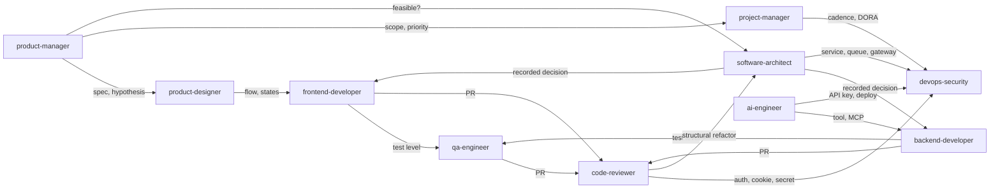

# Agents — Index

Agents are **roles**: each one receives a task in its own context, loads the skills and notes that role uses, and returns a result in the format that role produces. They **do not** repeat rules or procedures — they route to [Skills](../skills/README.md) (procedure) and to the [knowledge-base](../knowledge-base/MANIFESTO.md) (rule), citing by ID wherever one exists.

The relationship with the other folders is a chain, and each link has an owner:

| Layer | Folder | Answers | Example |
| --- | --- | --- | --- |
| **role** | `agents/` | *who* does the work, with what context, and what they deliver | `code-reviewer` |
| **procedure** | `skills/` | *how* to do it, in what order, and how to report it | `react-review` |
| **rule** | `knowledge-base/` | *what* is correct, by ID | [React - Rules of React](../knowledge-base/react-rules-of-react.md) `REACT-*` |

These are three links, not four: the reasoning layer was cut on 2026-09-22 and is no longer cited. `commands/` sits alongside them as a fourth **artifact type**, not a layer: a command is a fixed script a person invokes, while an agent is a role that decides what to load. A divergence between an agent and a skill is the agent's bug; between a skill and a note, the skill's bug ([Skills](../skills/README.md)).

**The API surface doesn't live here.** A library's signature, options, and version-specific behavior resolve through Context7, using the library ID the skill declares in `docs:`. The knowledge base answers what's correct and which ID to cite in a review — not what a function accepts in this minor version.

## The eleven agents

| Agent | Role | Skills it loads | Main sources |
| --- | --- | --- | --- |
| `code-reviewer` | Reviews a PR or an already-written file in fresh context: routes by family, classifies severity, cites ID and file:line, separates finding from opinion | `react-review` · `http-review` · `drizzle-review` · `playwright-review` · `bun-test-review` · `test-review` | `Code Review` · [Claude Code - Sessão e Verificação](../knowledge-base/claude-code-sessao-e-verificacao.md) |
| `frontend-developer` | Writes React in this house's stack: where it lives → who owns the state → which API | `react-structure` · `react-developer` · `tanstack-router` · `tanstack-query` · `react-hook-form` · `storybook-story` | [Frontend roadmap](../knowledge-base/frontend-roadmap.md) · [Architecture in React](../knowledge-base/architecture-in-react.md) · [Feature-Based Architecture](../knowledge-base/feature-based-architecture.md) |
| `backend-developer` | Writes services in Bun + Elysia/Hono + Drizzle: HTTP contract before the handler | `elysia-build` · `elysia-schema` · `elysia-diagnose` · `http-contract` · `http-cache` · `http-diagnose` · `bun-runtime` · `bun-workspace` · `bun-migrate` · `bun-test-build` | [Backend no runtime Bun](../knowledge-base/backend-no-runtime-bun.md) · [Elysia](../knowledge-base/elysia.md) · [HTTP](../knowledge-base/http.md) · [Drizzle ORM](../knowledge-base/drizzle-orm.md) |
| `qa-engineer` | Decides the test level, writes it in the right tool, audits and diagnoses the suite | `test-design` · `test-review` · `test-diagnose` · `playwright-build` · `playwright-review` · `playwright-diagnose` · `bun-test-build` · `bun-test-review` · `storybook-test` | [Teste de Software](../knowledge-base/teste-de-software.md) · [Playwright](../knowledge-base/playwright.md) · [Bun - Testes](../knowledge-base/bun-testes.md) |
| `software-architect` | Decides boundaries and responsibilities; records the decision with its axis, invariants, and migration path | `react-structure` | [Architecture in React](../knowledge-base/architecture-in-react.md) · [Fronteira do BFF - forma, jornada e regra](../knowledge-base/fronteira-do-bff-forma-jornada-e-regra.md) · Architecture, Design Patterns, and Microservices maps |
| `devops-security` | Pipeline, deploy, secrets, session, tokens, authorization | `bun-workspace` · `bun-migrate` | `Secret Management em DevOps - Mapa de Fundamentos` · [Trunk-based development](../knowledge-base/trunk-based-development.md) · [OWASP - Sessão e Autorização](../knowledge-base/owasp-sessao-e-autorizacao.md) |
| `ai-engineer` | Agents, tools, MCP, multi-agent systems, RAG, and semantic search; configures Claude Code; creates this project's skills and agents | — | AI Agents, MCP, Multi-agent Systems, RAG, and Semantic Search maps · [Claude Code](../knowledge-base/claude-code.md) |
| `product-manager` | Problem, hypothesis, discovery, prioritization, metrics, spec, recorded decision | — | `Produto e Inovação - Mapa de Fundamentos` · `Curso de Product Management (PM3) — Mapa` |
| `product-designer` | Persona, journey, flow, the four states of every screen, components, and catalog level | — | `Product Design` · `Product Team` · [Storybook estruturado por Atomic Design](../knowledge-base/storybook-estruturado-por-atomic-design.md) |
| `project-manager` | Scope, schedule, cost, risk, communication, and change as a system | — | `Gestão de Projetos - Mapa de Fundamentos` |
| `monorepo-auditor` | Audits the layers of an already-written monorepo: dependency direction, public surface, who opens a transaction, which boundary is verifiable | `bun-workspace` · `drizzle-review` · `react-structure` | [Monorepo com Bun - estrutura e tooling](../knowledge-base/monorepo-com-bun-estrutura-e-tooling.md) `MONO-*` · [Architecture in React](../knowledge-base/architecture-in-react.md) · [Fronteira do BFF - forma, jornada e regra](../knowledge-base/fronteira-do-bff-forma-jornada-e-regra.md) |

## Common anatomy

All eleven share the same shape, checkable by script, and it extends the anatomy from [Skills](../skills/README.md) with the fields a Claude Code subagent reads ([Claude Code - Configuração do Repositório](../knowledge-base/claude-code-configuracao-do-repositorio.md) § 7):

| Element | Rule |
| --- | --- |
| `name` | kebab-case, **identical** to the file name |
| `description` | **what** + **when to use** + **when not to use**, naming the neighboring agent — this is what the lead agent uses to decide whether to delegate |
| `tools` | the minimum the role uses: agents that decide and review **do not** have `Write`/`Edit` |
| `model` | `opus` by default; switching to `haiku` for a simple task is the most direct saving on a subagent |
| `skills` | skills **preloaded in full** at launch — only the ones the role uses on every task; occasional ones stay in the body's minimal loading |
| `fontes:` | the normative notes or maps the agent loads first |
| **critical instruction up top** | the body's first block, because post-compaction truncation preserves the beginning (`CC-CTX-07`) |
| `## Quando usar` | a routing table to the right agent or skill |
| `## Passo 1 — Carregar contexto` | reading order, and what to **never** load (entire course modules) |
| procedure steps | route to the skill; where there is no skill, to the normative note |
| output format + self-check | what the agent delivers and how it proves it (`CC-SES-01`) |
| `## Exemplo` | a worked case, with real IDs |
| `## Relacionados` | neighbors and sources |

## Disambiguation — the question decides the agent

| The question is… | Agent | Explicitly **not** |
| --- | --- | --- |
| is this **already-existing** code correct? approve or block? | `code-reviewer` | whoever writes it |
| write a component, Hook, router route, query, form, story | `frontend-developer` | `code-reviewer` · `qa-engineer` |
| write an HTTP route, handler, schema, plugin, migration, Bun workspace | `backend-developer` | `software-architect` · `devops-security` |
| **which test**, at what level; write, audit, or diagnose a test or suite | `qa-engineer` | whoever writes the feature |
| where this lives; is it worth separating; which pattern; monolith or services; BFF × backend | `software-architect` | whoever implements it |
| CI, deploy, Dockerfile, secret, cookie, JWT, OAuth, RBAC | `devops-security` | `backend-developer` writes the handler |
| agent, tool, MCP, multi-agent, RAG, embeddings, CLAUDE.md, new skill | `ai-engineer` | `backend-developer` · `devops-security` |
| is it worth building; what to prioritize; how to measure it; spec; hypothesis | `product-manager` | `product-designer` · `project-manager` |
| how should this work for the user; flow; screen states; usable, accessible | `product-designer` | `product-manager` · `frontend-developer` |
| how long; who does what; risk; does it fit the scope; status | `project-manager` | `product-manager` · `software-architect` |

Two axes separate most of the pairs. **New × already exists** separates those who write from `code-reviewer` — the same axis as in [Skills](../skills/README.md). **Decide × execute** separates `software-architect`, `product-manager`, `product-designer`, and `project-manager` from the three that write code: the four that decide have no `Write`/`Edit` on the repository and deliver a recorded decision; those that execute receive the decision and return code with evidence.

## How agents hand off

Each agent declares in its final step who it hands off to, and the arrow is always accompanied by an artifact: spec, recorded decision, flow with states, code with evidence, findings report.

This flowchart has a formal procedure in `skills/workflow/` — four skills, one per moment (research, planning, implementation, validation), that decide **when** to route to which of the eleven agents, citing rules by ID in [Fluxo de Entrega — Quatro Pilares](../knowledge-base/fluxo-de-entrega-quatro-pilares.md). The diagram above remains the source of **who**; the newer note is the source of **when**.

## Usage in Claude Code

**Installation.** Nothing here is installed by hand. `bash build/claude-code.sh` assembles the plugins in `dist/claude-code/`, translating the neutral frontmatter into the target format (`nome`→`name`, `capacidades`→`tools`, `modelo`→`model`) and rewriting links to stay inside the package. It's the same model as [Skills](../skills/README.md): **`agents/` is the source; `dist/` is the package.** Changing an agent means editing it here and running the build.

**What a subagent loads at startup** ([Claude Code - Configuração do Repositório](../knowledge-base/claude-code-configuracao-do-repositorio.md) § 7): **its own** system prompt (the note's body), the full content of the skills in the `skills:` field, the repository's CLAUDE.md, and whatever the lead agent passes in the prompt. Its reads **do not enter** the main context (`CC-PAR-01`) — which is why reviewing, investigating, and auditing are naturally subagent tasks.

**Invoking.** *"use code-reviewer on this diff"*, *"ask software-architect to decide where the CPF validation lives"*. The lead agent also delegates on its own when the `description` matches the task — which is why `description` carries **when not to use** and names the neighboring agent.

**Review in fresh context.** `code-reviewer` should receive **only the diff and the criteria**, never the conversation that produced the change (`CC-SES-07`), and the prompt must bound what counts as a finding (`CC-SES-10`). Fanning out several homogeneous reviewers (same model, effort, and tools) shares the cache ([Claude Code - Paralelismo e Escala](../knowledge-base/claude-code-paralelismo-e-escala.md)).

## What these notes are

Created on 2026-09-01 from already-existing material, and extracted into this repository on 2026-09-22: the 28 skills, the guided structures, and this house's decisions, now living in `knowledge-base/`. No agent asserts a rule that isn't backed by a note here; where a note marks something as unverified, the agent states the limitation instead of opining. A citation in a code span is a note that **has not** made it into the project — and it remains a citation by name, not a path.

**Inherited gaps, stated openly.** There is no build skill for Drizzle or for Hono — `backend-developer` reads the hub directly and reviews with `drizzle-review`. The OAuth, session, and RBAC cluster has no skill — `devops-security` works through the [OWASP - Sessão e Autorização](../knowledge-base/owasp-sessao-e-autorizacao.md) checklist item by item. The product and management agents derive from course maps that **have not** been extracted into this repository: they appear in a code span, by name. They have no rule ID to cite, and that is stated plainly, not hidden.

**Criterion for a new agent.** A role someone actually performs, with a question none of the eleven already answers, and material in the knowledge base to answer it. An agent with no source note is packaged opinion — it doesn't get in.

## Related

- [Skills](../skills/README.md) — skill index, common anatomy, and disambiguation
- [Fluxo de Entrega — Quatro Pilares](../knowledge-base/fluxo-de-entrega-quatro-pilares.md) — the formal procedure for "how agents hand off," with `WF-*` rules
- `Docs` — index of documentation structures and "which structures have a skill"
- [Claude Code - Configuração do Repositório](../knowledge-base/claude-code-configuracao-do-repositorio.md) — § 7, custom subagents
- [Claude Code - Paralelismo e Escala](../knowledge-base/claude-code-paralelismo-e-escala.md) — subagents, fan-out, shared cache
- `Sistemas Multiagentes - Mapa de Fundamentos` — supervisor and specialists: the same idea, in LangGraph
