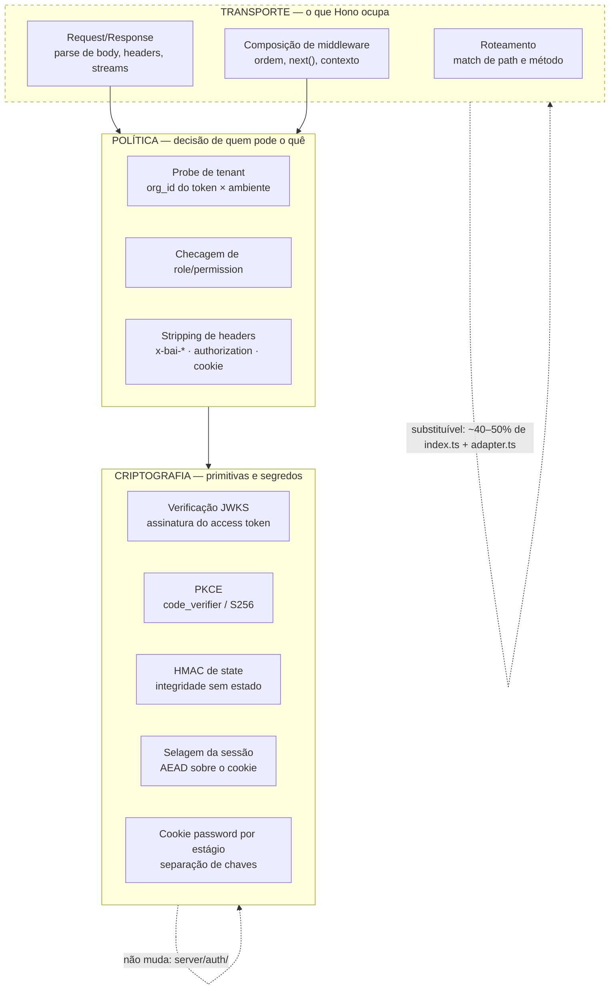
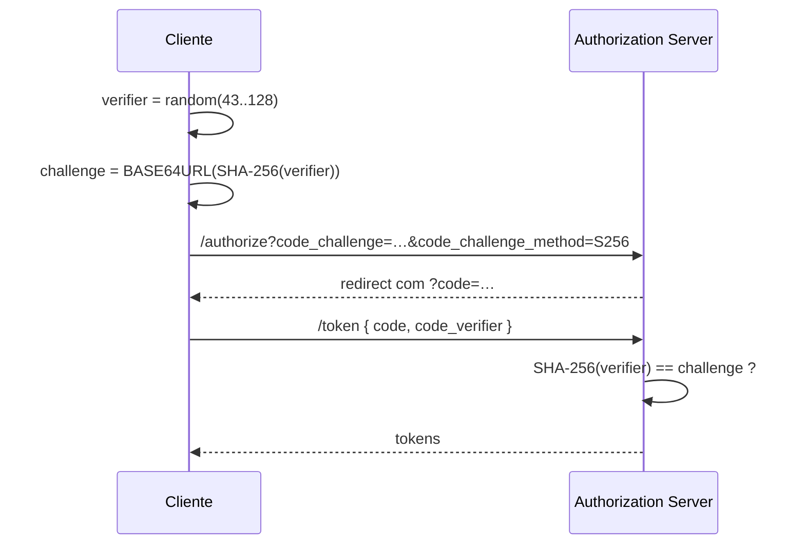

# Auth e cripto — siglas da decisão de framework

> Decodificação termo a termo de duas frases usadas para avaliar a troca de framework (Hono) na borda de autenticação, com a literatura de referência de cada item. A frase original:
>
> *"Nada visível ao usuário, e nenhum card do fundamento: verificação JWKS, refresh em navegação, error codes, cookie password por estágio e split de ambientes são todos ortogonais ao framework. A lógica security-critical continua nossa de qualquer jeito: PKCE, HMAC de state, selagem AES-GCM, shape da sessão, probe de tenant, stripping de `x-bai-*`/`authorization`/`cookie` no proxy. Hono troca transporte, não criptografia nem política — estimando pelo arquivo, uns 40–50% do `index.ts` + `adapter.ts` são substituíveis; o `server/auth/` quase não muda."*

A frase é um argumento de **camadas**: ela lista dez coisas e afirma que nenhuma delas mora na camada que o framework ocupa. Entender as siglas é entender por que o argumento fecha.

## 1. Mapa — onde cada item mora



A tese da frase: a seta de substituição só toca a caixa de cima. **Ortogonal** aqui é usado no sentido geométrico emprestado à arquitetura — dois eixos independentes, em que mover um não desloca o outro. Trocar quem faz o `match` de rota não altera qual chave assina o quê.

## 2. Tabela mestra

| Sigla / termo | Expande para | O que é, em uma linha | Literatura |
|---|---|---|---|
| **JWKS** | *JSON Web Key Set* | conjunto de chaves públicas publicado em URL, usado para verificar a assinatura de um JWT | [RFC 7517](https://www.rfc-editor.org/rfc/rfc7517) §5 |
| **JWT** | *JSON Web Token* | o token em si: claims JSON assinadas | [RFC 7519](https://www.rfc-editor.org/rfc/rfc7519) · [RFC 8725 - JWT Best Current Practices](rfc-8725-jwt-best-current-practices.md) |
| **JWS** | *JSON Web Signature* | o mecanismo de assinatura por trás do JWT | [RFC 7515](https://www.rfc-editor.org/rfc/rfc7515) |
| **PKCE** | *Proof Key for Code Exchange* | prova que quem troca o `code` é quem iniciou o fluxo, sem client secret | [RFC 7636](https://www.rfc-editor.org/rfc/rfc7636) · [RFC 9700 - OAuth 2.0 Security BCP](rfc-9700-oauth-2-0-security-bcp.md) §2.1.1 |
| **state** | — | valor opaco que atravessa o redirect e volta; defesa de CSRF do fluxo OAuth | [RFC 6749](https://www.rfc-editor.org/rfc/rfc6749) §10.12 · [RFC 9700 - OAuth 2.0 Security BCP](rfc-9700-oauth-2-0-security-bcp.md) §2.1 |
| **HMAC** | *Hash-based Message Authentication Code* | tag de integridade com chave secreta: prova que a mensagem não foi alterada | [RFC 2104](https://www.rfc-editor.org/rfc/rfc2104) · [FIPS 198-1](https://csrc.nist.gov/pubs/fips/198-1/final) |
| **AES** | *Advanced Encryption Standard* | a cifra de bloco simétrica padrão | [FIPS 197](https://csrc.nist.gov/pubs/fips/197/final) |
| **GCM** | *Galois/Counter Mode* | modo de operação do AES que cifra **e** autentica na mesma passada | [NIST SP 800-38D](https://csrc.nist.gov/pubs/sp/800/38/d/final) |
| **AEAD** | *Authenticated Encryption with Associated Data* | a categoria a que AES-GCM pertence: confidencialidade + integridade num primitivo | [RFC 5116](https://www.rfc-editor.org/rfc/rfc5116) |
| **CBC** | *Cipher Block Chaining* | modo de operação **sem** autenticação embutida; exige MAC separado | [NIST SP 800-38A](https://csrc.nist.gov/pubs/sp/800/38/a/final) |
| **PBKDF2** | *Password-Based Key Derivation Function 2* | deriva chave criptográfica de uma senha | [RFC 8018](https://www.rfc-editor.org/rfc/rfc8018) §5.2 |
| **BFF** | *Backend For Frontend* | o servidor que guarda os tokens e fala com o browser só por cookie | [OAuth 2.0 for Browser-Based Applications](oauth-2-0-for-browser-based-applications.md) §6.1 |
| **RBAC** | *Role-Based Access Control* | acesso por role, não por identidade | [NIST RBAC - ANSI INCITS 359](nist-rbac-ansi-incits-359.md) · [WorkOS - RBAC](workos-rbac.md) |
| **CSRF** | *Cross-Site Request Forgery* | site terceiro dispara request autenticada usando seu cookie | [OWASP - Sessão e Autorização](owasp-sessao-e-autorizacao.md) |
| **ASVS** | *Application Security Verification Standard* | checklist de verificação da OWASP, citado por número (`3.3.3`, `9.2.3`) | OWASP ASVS |
| **TTL** | *Time To Live* | validade de um artefato cifrado ou cacheado | — |

## 3. Item por item

### 3.1 Verificação JWKS

O access token do AuthKit é um JWT assinado pela WorkOS. **Verificar via JWKS** é: buscar o conjunto de chaves públicas em `https://api.workos.com/sso/jwks/<clientId>`, escolher a chave pelo `kid` do header do token e conferir a assinatura localmente — sem chamada de rede por request, porque o JWKS é cacheado.

Por que é ortogonal ao framework: a verificação recebe uma string e devolve claims. Não sabe o que é uma rota.

```ts
import * as jose from 'jose';

const JWKS = jose.createRemoteJWKSet(new URL(jwksUrl)); // cacheia as chaves
const { payload } = await jose.jwtVerify(accessToken, JWKS, {
  issuer: 'https://api.workos.com',
});
```

> [!warning] Não há claim `aud` no token do AuthKit
> A [RFC 8725 - JWT Best Current Practices](rfc-8725-jwt-best-current-practices.md) §3.9 pede validação de *audience*. O token
> publicado não tem `aud` — a separação de público sai de `iss` **+** `client_id`. Ver
> [WorkOS - AuthKit](workos-authkit.md) #5. Access token — claims.

### 3.2 Refresh em navegação

Refrescar o access token durante um **navigation request** (o request de documento, tratado por middleware/loader) em vez de dentro de um `fetch` de dados.

O motivo é mecânico: o refresh produz um cookie novo, e `Set-Cookie` só é aplicado de forma confiável quando a resposta é a de navegação — daí o padrão de **regravar o cookie e redirecionar para a mesma rota** ([WorkOS - AuthKit](workos-authkit.md) #3.4 Middleware withAuth — autenticar, e refrescar se preciso). Um refresh disparado por XHR paralelo compete com outras requests pela rotação do refresh token, e é exatamente por isso que existe a janela de graça de 30s.

Ortogonal porque o *quando* é uma propriedade do ciclo de request/response HTTP, não da biblioteca que o expõe.

### 3.3 Error codes

Os pares `error` + `error_description` que o Authorization Server devolve **no seu redirect URI**, em vez de lançar exceção:

```url
https://your-app.com/callback?error=organization_invalid&error_description=No%20connection...&state=123456789
```

Lista completa e a armadilha (tratar ausência de `code` como `400` genérico engole esses erros): [WorkOS - AuthKit](workos-authkit.md) #11.3 Erros na geração da URL. É contrato do provedor — nenhum framework o muda.

### 3.4 Cookie password por estágio

`WORKOS_COOKIE_PASSWORD` distinto em dev, staging e produção. O nome técnico do princípio é **separação de chaves** (*key separation* / *cryptographic separation*): uma chave serve a um propósito e a um domínio de confiança, para que o comprometimento de um estágio não renda sessões forjáveis em outro.

Literatura: [NIST SP 800-57 Part 1](https://csrc.nist.gov/pubs/sp/800/57/pt1/r5/final) §5.3 (*key usage* — "a chave deve ser usada para um único propósito"). O corolário inverso está documentado pela própria WorkOS: **compartilhar sessão entre domínios exige o mesmo `cookiePassword`** — ou seja, compartilhar senha é compartilhar domínio de confiança, por construção ([WorkOS - AuthKit](workos-authkit.md) #4.4 Cookie — o que o SDK de Next.js expõe).

### 3.5 Split de ambientes

Ambientes separados no WorkOS (staging × production), cada um com seu `client_id`, sua API key, seus redirect URIs e seu catálogo de roles. Um usuário de staging não existe em produção. É configuração de plataforma; o framework não participa.

### 3.6 PKCE

Fluxo em que o cliente gera um `code_verifier` aleatório de alta entropia, manda o **hash** dele (`code_challenge`, método `S256`) na authorization URL, e apresenta o verifier original na troca do code. Quem interceptar o `code` não consegue trocá-lo sem o verifier.



No AuthKit, `code_verifier` é *obrigatório* **quando não há client secret** — os dois são caminhos alternativos de prova do cliente ([WorkOS - AuthKit](workos-authkit.md) #11.1 PKCE — quando é obrigatório). Para um BFF confidencial a doc não exige; a [RFC 9700 - OAuth 2.0 Security BCP](rfc-9700-oauth-2-0-security-bcp.md) §2.1.1 recomenda de todo modo, como defesa em profundidade contra injeção de code.

### 3.7 HMAC de state

`state` é o valor que atravessa o redirect e volta intacto — a defesa de CSRF do fluxo de autorização. Há duas maneiras de confiar nele na volta:

| Estratégia | Como funciona | Custo |
|---|---|---|
| **Server-side** | guardar o `state` em sessão/cache e comparar no callback | precisa de armazenamento compartilhado entre instâncias |
| **HMAC** | embutir os dados no próprio `state` e anexar `HMAC(chave, dados)`; no callback, recalcular e comparar | stateless; exige a chave e comparação em tempo constante |

"HMAC de state" é a segunda: o `state` carrega o destino pretendido (o `returnTo`) e uma tag que prova que ninguém o reescreveu. É o que permite ser stateless **sem** abrir open redirect — mas note que HMAC prova *integridade*, não *pertencimento*: continua sendo necessário amarrar o `state` ao browser daquele usuário e manter allowlist de rotas internas ([WorkOS - AuthKit](workos-authkit.md) #11.2 state é responsabilidade sua).

Comparação de tags deve ser em tempo constante (`crypto.timingSafeEqual`), não `===` — vazamento por timing é o ataque clássico contra verificação de MAC.

### 3.8 Selagem AES-GCM

**Selar** = transformar o conteúdo da sessão (access token + refresh token + claims) num blob que vai no cookie: cifrado, para o browser não ler; autenticado, para ninguém alterar. **AES-GCM** faz as duas coisas num primitivo — é AEAD ([RFC 5116](https://www.rfc-editor.org/rfc/rfc5116)), com a *associated data* servindo para amarrar contexto não cifrado (versão, nome do cookie) à tag de autenticação.

> [!important] A frase esconde uma imprecisão útil
> A sessão selada da **WorkOS** não é AES-GCM. O prefixo `Fe26.2*` do `sealedSession` é o
> formato **iron**, cujo perfil default é **AES-256-CBC + HMAC-SHA-256** em
> *encrypt-then-MAC*, com chave derivada por **PBKDF2** — a própria doc do
> `iron-webcrypto` registra o default como *"AES-256-CBC + SHA-256, 256-bit salts, no TTL"*
> e trata AES-GCM como possibilidade futura.
>
> Ou seja: se a selagem AES-GCM é nossa, ela é uma **segunda camada**, com escolha
> criptográfica melhor que a do provedor (um primitivo em vez de dois compostos à mão), e
> mais um motivo para `server/auth/` não ser terceirizável para um framework. Vale
> confirmar na versão instalada antes de afirmar em revisão.

Ponto genérico que vale para qualquer AEAD: **nonce/IV nunca se repete sob a mesma chave**. Em GCM, reuso de nonce é catastrófico — vaza o *authentication key*, não só o plaintext. Se a selagem é própria, essa é a invariante a proteger em teste.

### 3.9 Shape da sessão

O **contrato** do que a sessão carrega e com quais tipos: `user`, `organizationId`, `role`/`roles`, `permissions`, `entitlements`, `impersonator`, e o que a aplicação acrescenta. "Shape" no sentido de TypeScript — a forma do objeto.

É política e domínio, não transporte: mudar o shape muda todo consumidor a jusante; mudar de framework não muda nenhum campo. É também onde mora o **orçamento de bytes** — o shape vai para o cookie, e o cookie tem teto de ~4KB ([RFC 6265 - Cookies HTTP](rfc-6265-cookies-http.md)), com 3072 bytes de teto no que um JWT template renderiza ([WorkOS - AuthKit](workos-authkit.md) #6. JWT templates).

### 3.10 Probe de tenant

Verificação ativa de que o **tenant do token** corresponde ao **tenant do ambiente** que está atendendo a request: o `org_id` da claim é conferido contra a configuração daquele deployment, e divergência derruba a request.

O racional já está registrado em [WorkOS - AuthKit](workos-authkit.md) #14. Notas de arquitetura — bondingAI: a camada de identidade é *pooled* mesmo com infraestrutura *siloed*, então o `org_id` é **asserção a ser conferida, não fonte de verdade**. Sem o probe, um token legítimo de outro tenant é aceito por um silo que não é o dele — a falha de autorização por *object/tenant* que a literatura chama de **IDOR** em nível de tenant, e que a OWASP classifica em *Broken Object Level Authorization*.

### 3.11 Stripping de `x-bai-*` / `authorization` / `cookie` no proxy

Remover headers antes de encaminhar a request adiante. Três classes distintas, com motivos distintos:

| Header | Por que remover |
|---|---|
| `x-bai-*` | headers **internos** da plataforma (convenção do projeto — o prefixo `x-bai-` marca metadados injetados pela borda, ex.: tenant, identidade resolvida). Se um cliente externo puder enviá-los, ele **falsifica** o que a borda deveria ser a única a afirmar |
| `authorization` | credencial destinada a *este* hop; repassá-la adiante entrega credencial a um upstream que não deveria vê-la |
| `cookie` | idem, e pior: carrega a sessão selada inteira |

O nome clássico do problema é **confused deputy** (Norm Hardy, 1988): um componente com mais autoridade age a pedido de um com menos, sem distinguir o que veio de fora do que ele mesmo afirmou. Stripping é a defesa: **o que a borda injeta, a borda apaga na entrada**. Também é a razão de existir o [`Forwarded`](https://www.rfc-editor.org/rfc/rfc7239) padronizado — headers de proxy só valem se o hop anterior for confiável, e a confiabilidade é decidida por quem apaga.

Isto é **política**: depende de qual header significa o quê no seu domínio. Um framework de HTTP oferece a API para ler e apagar headers; ele não sabe que `x-bai-tenant` é sagrado.

### 3.12 Hono, transporte, e o que "substituível" quer dizer

**Hono** é um framework web sobre Web Standards (`Request`/`Response` nativos): roteamento, composição de middleware, helpers de cookie e validação, portável entre runtimes (Workers, Deno, Bun, Node). O que ele entrega é a camada de cima do mapa em [§1](#1-mapa-onde-cada-item-mora).

"**Troca transporte, não criptografia nem política**" é a afirmação de que a fronteira do refactor coincide com a fronteira de arquivos:

| Arquivo | Natureza | Estimativa da frase |
|---|---|---|
| `index.ts` | composição, roteamento, wiring | ~40–50% substituível |
| `adapter.ts` | ponte entre runtime e handlers | ~40–50% substituível |
| `server/auth/` | primitivas cripto + política | "quase não muda" |

> [!note] O que essa assimetria informa
> Uma estimativa que diz "metade de dois arquivos de wiring, nada do módulo de auth" é um
> teste de **acoplamento**, não de esforço. Se o número do `server/auth/` fosse alto, a
> conclusão correta não seria "a migração é caríssima" — seria "há lógica de segurança
> vazada para dentro do transporte", e o refactor a fazer primeiro seria outro.

### 3.13 O vocabulário que sobra

| Termo | Significado na frase |
|---|---|
| **ortogonal ao framework** | vive em outro eixo; muda de framework sem tocar nisso |
| **security-critical** | código cuja falha é uma vulnerabilidade, não um bug de UX — logo, não terceirizável nem "melhor esforço" |
| **"nada visível ao usuário"** | a mudança não produz diferença observável na interface: não há o que demonstrar, revisar visualmente ou testar por aceitação de UI |
| **"nenhum card do fundamento"** | nenhum item da fase/épico *Fundamento* do board é afetado (terminologia de planejamento do projeto) — dito junto com o anterior, é o argumento de que o trabalho **não tem entregável de produto** |
| **`index.ts` · `adapter.ts` · `server/auth/`** | as três camadas do código: composição, ponte de runtime, e o módulo de autenticação |

## 4. A forma do argumento

Reconstruído:

1. Não há entrega visível nem card afetado → o trabalho não paga em produto.
2. Cinco preocupações (JWKS, refresh, error codes, chaves por estágio, ambientes) são ortogonais → o framework não as melhora.
3. Seis preocupações (PKCE, HMAC de state, selagem, shape, probe, stripping) são security-critical e nossas → o framework não as assume.
4. Portanto o ganho fica confinado ao transporte, e o custo se mede em `index.ts` + `adapter.ts`.

O que **não** está na frase, e é onde uma decisão real se decide: o transporte tem ganhos próprios — portabilidade de runtime, tipagem de middleware, tamanho de bundle no edge. A frase estabelece com precisão que a troca **não é** de segurança; ela não afirma que a troca não valha por outro motivo.

## Relacionados

- [WorkOS - AuthKit](workos-authkit.md) — a implementação concreta de tudo em §3
- [WorkOS - RBAC](workos-rbac.md) — onde `role`/`permissions` do shape da sessão são consumidos
- [OAuth 2.0 for Browser-Based Applications](oauth-2-0-for-browser-based-applications.md) — o padrão BFF que justifica o proxy
- [RFC 9700 - OAuth 2.0 Security BCP](rfc-9700-oauth-2-0-security-bcp.md) — PKCE, `state`, redirect URI exato
- [RFC 8725 - JWT Best Current Practices](rfc-8725-jwt-best-current-practices.md) — verificação de JWT e a lacuna do `aud`
- [RFC 6265 - Cookies HTTP](rfc-6265-cookies-http.md) — teto de 4KB e atributos do cookie selado
- [OWASP - Sessão e Autorização](owasp-sessao-e-autorizacao.md) — checklist de revisão
- [NIST RBAC - ANSI INCITS 359](nist-rbac-ansi-incits-359.md) — modelo formal de roles
