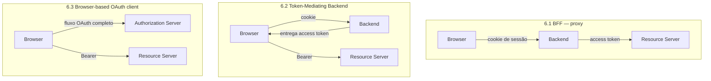

> [!warning] Ainda é draft — confira antes de citar
> Em **2026-08-12**: revisão **-27**, de **2026-07-06**, estado **RFC Ed Queue / In Progress**.
> Intenção: **Best Current Practice**. AD responsável: Deb Cooley. Shepherd: Rifaat Shekh-Yusef.
> Ou seja: passou pelo IESG, está na fila do RFC Editor e **deve ganhar número de RFC a
> qualquer momento**. Antes de citar em ADR ou documento durável, cheque o datatracker e
> troque a referência pelo número definitivo.

## Por que este é o documento certo para a decisão

É literalmente o texto que compara *token no browser* × *BFF*, com nomes próprios para cada arranjo e uma análise explícita do que cada um perde quando existe JavaScript malicioso na página. Não é opinião de blog: é o consenso do working group do OAuth.

A premissa que organiza tudo está na **§5 (The Threat of Malicious JavaScript)**: a pergunta não é "dá para guardar token com segurança no browser?", é "**o que o atacante consegue fazer depois de executar JS na sua origem?**". As três arquiteturas se diferenciam pelo teto de dano, não pela dificuldade do ataque inicial.

---

## Estrutura

| Seção | Conteúdo |
|---|---|
| 4 | História do OAuth em apps de browser (por que o implicit existiu e morreu) |
| **5** | **A ameaça de JavaScript malicioso** — a premissa de todo o resto |
| **6** | **Padrões de arquitetura** — 6.1 BFF, 6.2 Token-Mediating Backend, 6.3 Browser-based OAuth client |
| 7 | Padrões desencorajados e depreciados |
| 8 | Armazenamento de token no browser |
| 9 | Considerações de segurança |

---

## §6 — os três arranjos

### 6.1 — Backend For Frontend (recomendado)

O backend é um **cliente confidencial** que guarda todos os tokens e **faz proxy** de todas as chamadas aos resource servers. O browser recebe apenas um cookie de sessão.

- Recomendado para "business applications, sensitive applications, and applications that handle personal data" — a categoria em que o produto se encaixa.
- Garantia central: **usar OAuth não aumenta a superfície de ataque da aplicação**. Sem BFF, adotar OAuth acrescenta tokens roubáveis que antes não existiam.
- Mitiga roubo de access token, roubo de refresh token e aquisição de tokens novos. Sobra apenas **client hijacking** — o atacante age *através* da sessão do usuário, enquanto ele está lá, sem levar credencial nenhuma para casa.

**Requisitos explícitos do BFF:**

| Nível | Requisito |
|---|---|
| MUST | Ser cliente confidencial (credenciais junto ao AS) |
| MUST | Usar Authorization Code grant |
| MUST | Cookies com `Secure` |
| MUST | Cookies com `HttpOnly` |
| MUST | Defesa de CSRF adequada |
| MUST | Ao fazer proxy: validar host de destino, permitindo só hosts e paths explicitamente autorizados |
| MUST | Se a defesa de CSRF for via CORS: exigir header customizado em toda request |
| SHOULD | `SameSite=Strict` |
| SHOULD | `Path=/` |
| SHOULD NOT | Definir `Domain` |
| SHOULD | Prefixo no nome do cookie indicando origem HTTP (`__Host-`) |
| SHOULD | Cifrar o conteúdo do cookie se a sessão for client-side e contiver access token |

> [!important] O item mais fácil de esquecer
> **Validação de host de destino no proxy.** Um BFF que aceita `/api/proxy?url=…` sem allowlist
> vira SSRF autenticado — com o access token anexado. O requisito é MUST por isso.

### 6.2 — Token-Mediating Backend (condicional)

Backend confidencial obtém os tokens, mas **entrega o access token ao browser**, que chama os resource servers direto.

- Recomendado **apenas** quando os casos de uso ou requisitos de sistema impedem o BFF proxy.
- Mitiga roubo de refresh token e aquisição de novos tokens — ou seja, corta os cenários que dariam ao atacante **acesso de longo prazo**.
- Não mitiga: o access token está no browser e vai embora junto com o XSS. Janela de dano = TTL do access token.
- **DPoP não resolve trivialmente aqui**: quem troca code/refresh por access token é o backend, mas quem usa o token é o app. Sender-constraining exigiria dividir a responsabilidade entre duas partes.

### 6.3 — Browser-based OAuth client (desencorajado)

A SPA é um cliente público e conduz o fluxo inteiro. Vulnerável a **todos** os cenários de ataque: com JS malicioso, o atacante obtém access token *e* refresh token direto do AS.

---

## §8 — armazenamento no browser

| Mecanismo | Veredito |
|---|---|
| Cookie `HttpOnly` | Preferido nos padrões BFF / token-mediating |
| `localStorage` / IndexedDB | Vulnerável a XSS; token guardado ali é token roubável |
| Service Worker / Web Worker | Discutidos; isolamento insuficiente para servir de garantia |
| Em memória | Perde no refresh de página; sozinho não basta |

Ponto que fecha a discussão: com **token-mediating backend não há necessidade de armazenamento persistente no browser**, e com **BFF os tokens nunca entram no browser**.

## Refresh token no browser

Se o AS emite refresh token para cliente de browser, ele **MUST**:

1. rotacionar a cada uso **ou** usar refresh token sender-constrained; **e**
2. impor tempo de vida máximo **ou** expirar por inatividade.

O tempo de vida não pode se estender além do tempo de vida do refresh token inicial.

> [!note] Limite honesto do DPoP
> O draft observa que, no cenário em que o atacante consegue **um token novo** (não rouba, mas
> obtém um), ele configura DPoP com par de chaves próprio. Sender-constraining protege contra
> exfiltração de token existente, **não** contra um atacante que roda dentro da sua origem e
> pede um token para si.

---

## Aplicação ao projeto

- O arranjo atual — cookie `HttpOnly` de sessão selada no server ([WorkOS - AuthKit](workos-authkit.md) §3) com o server chamando o WorkOS — é **6.1, BFF**. É o padrão recomendado; a decisão certa já está tomada, resta cumprir a lista de MUST/SHOULD.
- A alternativa de repassar Bearer do app para o server ([WorkOS - AuthKit](workos-authkit.md) §4) é **6.2, token-mediating** — degradação consciente, aceitável só se houver requisito que impeça o proxy.
- Itens da tabela para conferir contra a implementação: `SameSite`, ausência de `Domain`, prefixo `__Host-`, defesa de CSRF explícita, allowlist no proxy.
- O ponto do `Domain` esbarra no arranjo de hosts: `SHOULD NOT set Domain` é incompatível com compartilhar cookie entre app e API em hosts diferentes. Ver [RFC 6265 - Cookies HTTP](rfc-6265-cookies-http.md) — a saída é mesmo-host (proxy sob o mesmo origin), não cookie de domínio-pai.

> [!check] Aberto
> - [ ] Reconferir o número de RFC quando sair da fila do RFC Editor
> - [ ] `SameSite=Strict` quebra o retorno do redirect do AS? (Lax no cookie de sessão vs Strict — testar o callback)
> - [ ] Existe rota de proxy genérico no server? Se sim, allowlist de host

## Relacionados

- [RFC 9700 - OAuth 2.0 Security BCP](rfc-9700-oauth-2-0-security-bcp.md) — a BCP geral que este documento especializa
- [RFC 6265 - Cookies HTTP](rfc-6265-cookies-http.md) — `SameSite`, `Domain`, prefixos
- [OWASP - Sessão e Autorização](owasp-sessao-e-autorizacao.md) — checklist de revisão
- [WorkOS - AuthKit](workos-authkit.md)
- — o BFF como padrão de arquitetura, sem o recorte de segurança
