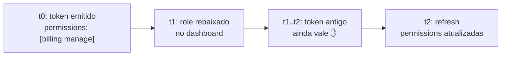

> [!warning] Escrito de memória, não a partir da doc oficial
> Gerado sem acesso à documentação do WorkOS. Conceitos e trade-offs tendem a estar
> corretos; **nomes de campos, limites e defaults precisam de conferência**. Checklists
> por seção. Preencher `verificado-em` após validar.

---

## 1. Modelo de dados

```
Environment
  ├── Role (slug, name, descrição)
  │     └── Permission[] (slug)
  └── Organization
        └── OrganizationMembership (user × org × role)
```

- **Role** — definido no nível do *environment*. Todas as orgs do ambiente compartilham esse catálogo. **Correção (2026-08-12):** a doc oficial descreve também **custom roles com escopo de organização**, que sobrepõem os do ambiente e recebem prefixo `org` no slug — ver [WorkOS - AuthKit](workos-authkit.md) §6. Ou seja, o catálogo não é só de ambiente.
- **Permission** — também de ambiente, identificada por slug. É a unidade que o código consome.
- **OrganizationMembership** — a ligação usuário × organização, portadora do role. Um usuário em N orgs tem N memberships e potencialmente N roles distintos.
- Existe um **role default**, atribuído a novas memberships quando nenhum é especificado.

**Consequência de desenho:** como roles são de ambiente e o deployment é siloed, cada silo tem seu próprio catálogo. Divergência entre silos é possível e silenciosa — vale um script que compare os catálogos entre ambientes.

> [!check] Verificar
> - [x] Roles são de ambiente **e** de organização (custom roles) — [WorkOS - AuthKit](workos-authkit.md) §6
> - [x] Existe role default semeado: `member`
> - [x] Limite prático: as claims do JWT de sessão esbarram em ~4KB de cookie
> - [ ] Se há hierarquia de roles (herança) ou se é lista plana — o que existe documentado é **multi-role** (claim `roles`, união de permissões), que não é herança
> - [ ] Limites numéricos: nº de roles por ambiente, permissões por role

---

## 2. Como as permissões chegam ao código

- Via claims do access token: `role` (slug único) e `permissions` (array de slugs). Em **modo multi-role** a claim passa a ser `roles` (plural) e `permissions` traz a **união** das permissões dos roles atribuídos. O token carrega ainda `entitlements` e `feature_flags` — ver [WorkOS - AuthKit](workos-authkit.md) §5.
- **O array é o que o código deve consultar.** Checar `role === 'admin'` acopla a lógica ao catálogo e quebra quando um role novo aparece; checar `permissions.includes('members:invite')` sobrevive.
- Regra geral: role é para exibição e administração; permission é para decisão.

```ts
// ❌ frágil
if (session.role === 'admin') { /* ... */ }

// ✅ estável
if (session.permissions.includes(P.membersInvite)) { /* ... */ }
```

> [!check] Verificar
> - [ ] Se `permissions` vem sempre ou depende de configuração/plano
> - [ ] Se sessão sem organização traz `permissions` (provavelmente vazio/ausente)
> - [ ] Se há API para listar permissões de um usuário fora do token

---

## 3. Catálogo tipado como contrato

Fonte única de verdade dos slugs, compartilhada entre server e app:

```ts
// packages/auth-contract/permissions.ts
export const P = {
  membersRead:   'members:read',
  membersInvite: 'members:invite',
  membersRemove: 'members:remove',
  billingRead:   'billing:read',
  billingManage: 'billing:manage',
} as const;

export type Permission = (typeof P)[keyof typeof P];
```

- Os slugs precisam bater **exatamente** com os cadastrados no dashboard. Typo não gera erro: gera negação silenciosa.
- Mitigação: teste que lista as permissões via API do WorkOS e compara com os valores do objeto `P`. Roda no CI, falha no drift.
- Convenção de slug: `recurso:ação`, minúsculo, sem plural inconsistente. Escolha uma e documente — depois de 40 permissões, mudar dói.

> [!check] Verificar
> - [ ] Endpoint de listagem de permissões (para o teste de drift)
> - [ ] Caracteres permitidos em slug
> - [ ] Se slug é mutável após criação

---

## 4. Enforcement — as três camadas

| Camada | Onde | Papel | Confiável? |
|---|---|---|---|
| Componente | `<Can permission>` | esconde botão | ❌ cosmético |
| Rota | `beforeLoad` do TanStack Router | evita tela vazia | ❌ UX |
| Handler | middleware do Hono | **decide** | ✅ autoritativo |

**A regra que organiza tudo:** o frontend *reflete* permissões, nunca as *decide*. Se remover as camadas 1 e 2, a segurança fica intacta — só a experiência piora. Se remover a 3, não há segurança.

```ts
// server — a única camada que importa
export const requirePermission = (...needed: Permission[]) =>
  createMiddleware<Env>(async (c, next) => {
    const { permissions } = c.get('session');
    if (!needed.every((p) => permissions.includes(p))) {
      throw new HTTPException(403, { message: 'insufficient_permissions' });
    }
    await next();
  });

export const members = new Hono<Env>()
  .use(authenticate)
  .get('/', requirePermission(P.membersRead), listMembers)
  .post('/invite', requirePermission(P.membersInvite), inviteMember);
```

- `every` (AND) como default é a escolha segura. Para OR, exponha `requireAnyPermission` explícito em vez de flag — a semântica precisa estar legível na definição da rota.
- **Não esconda o guard no service.** Quem lê a rota tem que ver a permissão exigida.

---

## 5. Staleness — o problema central

As permissões estão *dentro* do access token. Mudar o role de um usuário no dashboard **não afeta a sessão em curso** até o próximo refresh.



Janela de exposição ≈ TTL do access token.

**Opções, em ordem de custo:**

1. **Aceitar** — adequado para a maioria das permissões. TTL curto limita o dano.
2. **Revalidar no handler** — em operações sensíveis (billing, remoção de usuário, mudança de permissão), consultar a API do WorkOS em vez de confiar na claim. Custo: latência + rate limit.
3. **Forçar refresh via webhook** — reagir a eventos de mudança de membership invalidando a sessão. Complexidade alta; só se o requisito for real.

Decidir isso **por permissão**, não globalmente. Documentar quais caem no caso 2.

> [!check] Verificar
> - [ ] TTL default do access token (define a janela)
> - [ ] Eventos de webhook relacionados a role/membership
> - [ ] Se existe mecanismo oficial de invalidação forçada de sessão

---

## 6. 403 como sinal canônico

O `403` do server é o único ponto onde o app descobre que sua visão de permissões está errada.

```ts
// app — handler global do TanStack Query
queryCache: new QueryCache({
  onError: (error) => {
    if (error.status === 403) {
      queryClient.invalidateQueries({ queryKey: ['me'] }); // permissão pode ter mudado
      // → tela de acesso negado
    }
  },
})
```

- `401` → sessão inválida → redirect para login.
- `403` → sessão válida, permissão insuficiente → invalidar `/me` e mostrar acesso negado. **Não** redirecionar para login: confunde o usuário e esconde o problema real.

---

## 7. Limites do RBAC — quando o modelo não serve

RBAC responde *"pode editar documentos?"*. Não responde *"pode editar **este** documento?"*.

- Permissão por recurso (ownership, compartilhamento, hierarquia de pastas) **não** cabe em RBAC de slugs. Tentar encaixar produz explosão combinatória de roles.
- Sinal de alerta: aparecer necessidade de role tipo `editor:projeto-x`.
- Se esse requisito existir no roadmap, é melhor descobrir agora: o desenho de ReBAC/ABAC é suficientemente diferente para que a migração tardia seja caro.
- Referência conceitual: o paper do Google Zanzibar (USENIX ATC 2019).

**Divisão prática:** RBAC do WorkOS para permissão *funcional* (o que o usuário pode fazer no produto); lógica de aplicação para permissão *sobre instância* (em quais registros). Não misturar as duas no mesmo mecanismo.

---

## 8. Checklist de decisão do catálogo

- [ ] Convenção de slug definida e escrita
- [ ] Catálogo de permissões em pacote compartilhado, tipado
- [ ] Teste de CI comparando catálogo local × API do WorkOS
- [ ] Role default definido conscientemente (qual o mínimo privilégio?)
- [ ] Lista das permissões que exigem revalidação (caso 2 da §5)
- [ ] Comparação de catálogos entre silos automatizada
- [ ] Semântica AND/OR explícita nos guards
- [ ] `403` vs `401` tratados diferentes no app
