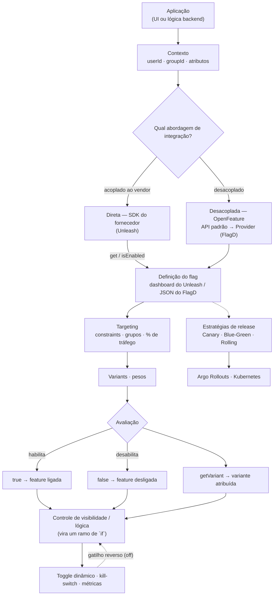
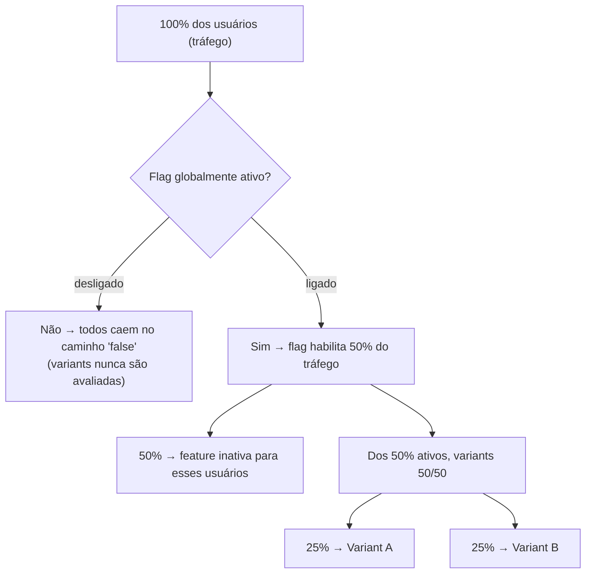
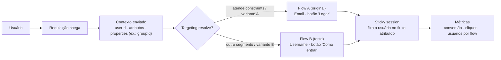

# Feature Flags — modelo visual do fluxo

> Modelo visual derivado do módulo **Feature Flags** (Rocketseat — Expansão de Habilidades). Os diagramas estão em Mermaid e renderizam nativamente no Obsidian. Eles cobrem o fluxo end-to-end: abordagens de integração, definição/avaliação do flag, A/B testing e estratégias de release.

## Fluxo principal

## Distribuição de variantes (detalhe)

Como o *global enablement* atua como portão antes dos *weights* das variants:

> Pontos do módulo: o split dos variants incide **sobre o pool ativo**, não sobre os 100% — por isso 50% de flag ativo + variants 50/50 resultam em 25%/25% (e 50% fora). O `isEnabled`/`getBooleanValue` retorna `true|false`; `getVariant` devolve qual variante o usuário recebeu (essencial para log e comparação A/B).

## A/B testing com targeting e sticky sessions

> No módulo: para um resultado de teste confiável, o usuário não pode "teleportar" de Flow A para Flow B num refresh — daí a necessidade de *sticky sessions*, que o fornecedor (ex.: Unleash) gerencia automaticamente.

## Notas de implementação (resumo do fluxo)

- **Unleash (vendor direto):** a aplicação chama o SDK com um contexto; o serviço aplica constraints + `%` e devolve `true|false` (ou a variante). Apache-style/Open Source roda local via Docker (`docker network create unleash`); o **Open Source é self-hosted**, com custo operacional, enquanto o **Unleash Cloud** tem trial de 14 dias.
- **OpenFeature/FlagD (desacoplado):** a aplicação depende só da **interface OpenFeature**; o **provider** (Ex. FlagD) conversa com o serviço. FlagD é **code-first** — usa arquivos de definição JSON/YAML (schema) como fonte de verdade, sem dashboard, com playground em `flagd.dev` para validar targeting. Conexão gRPC; usar *wait-for* no startup para evitar *race condition*.
- **Deploy gradual (K8s):** com **Argo Rollouts** (CRD no cluster + controlador), a migração é de `Deployment` → `Rollout`, permitindo **Canary** em passos (ex.: 8 passos com `%` de tráfego e waits) e **Blue-Green**, com `preview services`, revisões e rollback via UI.

## Relacionados

- `Feature Flags - Expansão de Habilidades - Rocketseat`
- [Trunk-based development](trunk-based-development.md)