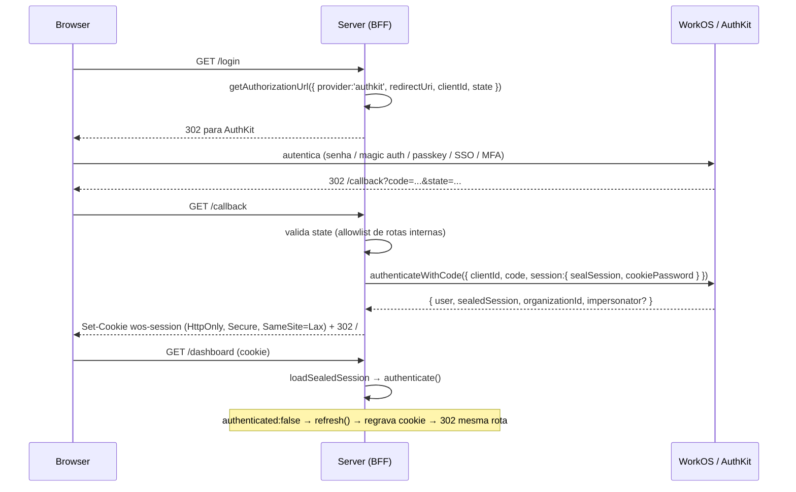
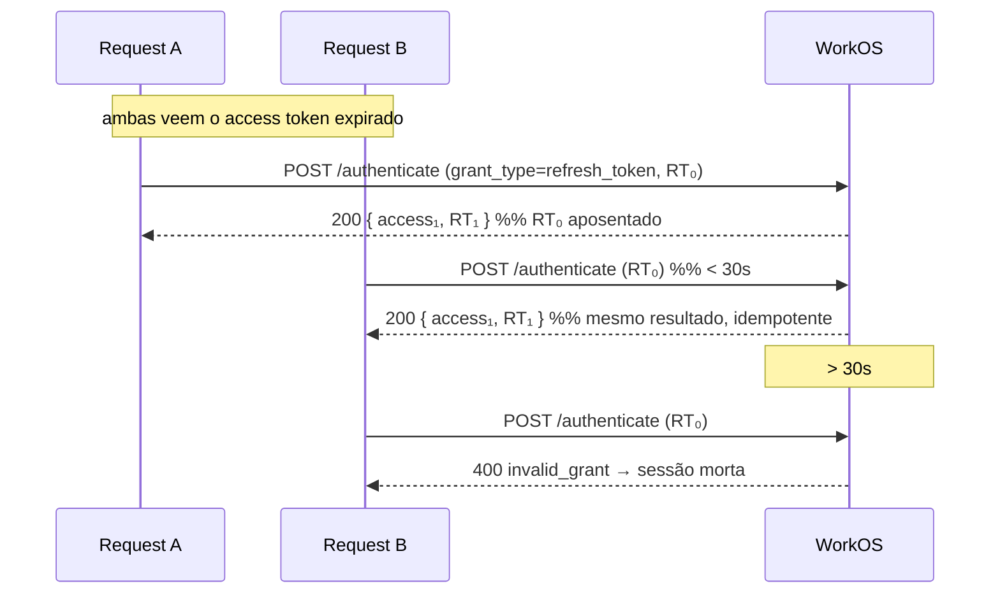
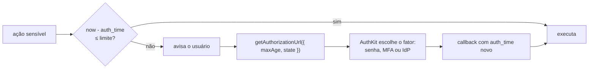

> [!info] Origem desta nota
> Resumo da documentação oficial do AuthKit, lida em **2026-08-12** a partir das versões
> `.md` cruas das páginas (`https://workos.com/<path>.md`, indexadas em
> `https://workos.com/docs/llms.txt`) — por isso os blocos de código abaixo são os da
> documentação, não paráfrases. Foco em **JavaScript/Node**. O que **não** está
> documentado está isolado em [§15](#15-aberto-nao-encontrado-na-documentacao-lida).

## 1. O que é

Plataforma de gestão de usuários da WorkOS: autenticação + recursos de segurança organizacional. Métodos suportados: **SSO**, **e-mail + senha**, **social login**, **passkeys**, **Magic Auth** (passwordless), **MFA/TOTP** e **CLI auth**.

Dois caminhos de integração:

| Caminho        | Descrição                                                                                                                                                                                                  |
| -------------- | ---------------------------------------------------------------------------------------------------------------------------------------------------------------------------------------------------------- |
| **Hosted UI**  | Tela de login pré-construída, hospedada pela WorkOS. Caminho mais rápido; o AuthKit hospedado **trata os erros de autenticação por você** (verificação de e-mail, desafio de MFA, seleção de organização). |
| **API direta** | Experiência própria contra a API pública. Passa a ser sua a obrigação de tratar cada [erro de autenticação](https://workos.com/docs/reference/authkit/authentication-errors).                              |

Proteções embutidas: verificação de e-mail **ligada por padrão**, *identity linking* (evita conta duplicada e spoofing), normalização de dados vindos de IdPs distintos, detecção de bots (Radar) e MFA opcional por ambiente.

Setup: `npx workos@latest` (instalador/CLI que integra, provisiona ambientes e gerencia recursos) ou os guias manuais por framework — **Next.js, React, Remix, React Router, SvelteKit, Astro, TanStack Start** e *vanilla* (**Node.js, Python, Ruby**).

Modelo mental: OAuth 2.0 Authorization Code. AuthKit é o Authorization Server; a aplicação é o cliente confidencial — o padrão **BFF** de [OAuth 2.0 for Browser-Based Applications](oauth-2-0-for-browser-based-applications.md) §6.1.

---

## 2. Modelo de dados

```
Organization ──┐
               ├── OrganizationMembership (user × org, com role/roles)
User ──────────┘
                 └── Group (membros agrupados dentro da org)
```

- **User** — identificado unicamente por **e-mail**. A doc é explícita sobre a consequência: quem tem acesso à caixa de entrada tem acesso a todas as contas baseadas naquele endereço. O identity linking impede e-mails duplicados.
- **Organization** — coleção de usuários sob controle do contato de TI do cliente; container de recursos e quem determina propriedade de dados no modelo B2B.
- **OrganizationMembership** — a ligação usuário × organização, portadora do role. Três status: **pending** (convidado), **active**, **inactive** (desativado).
- **Group** — organiza membros dentro da organização; suporta atribuição de role por grupo (todo membro herda).

Entrada de usuários: **convites** ou **JIT provisioning** (provisionamento automático de usuário e membership no primeiro login).

Remoção: **delete** (hard) ou **deactivate** (soft). A deactivation preserva referências históricas; o delete cabe quando o membro opera só sobre dados do cliente e não tem dados próprios.

Verificação de e-mail é padrão em todos os métodos — exceção: no SSO, se o domínio do e-mail bate com um domínio verificado da organização, o usuário já é considerado verificado.

---

## 3. Integração Node/Express ponta a ponta

Os quatro segredos/config de servidor:

```bash
# .env
WORKOS_API_KEY='sk_example_123456789'
WORKOS_CLIENT_ID='client_123456789'
WORKOS_COOKIE_PASSWORD='<32 caracteres>'   # openssl rand -base64 32
CSRF_SECRET='<segredo do double-submit>'
```

O `cookiePassword` tem **32 caracteres**. `WORKOS_API_KEY` e `WORKOS_COOKIE_PASSWORD` nunca vão para o bundle do cliente.

### 3.1 Dashboard — três URIs, não uma

Em *Applications › Redirects*:

| Config | Papel | Se faltar |
|---|---|---|
| **Redirect URI** | callback que troca o `code` pelo User (ex.: `http://localhost:3000/callback`) | usuário não consegue entrar |
| **Initiate login URL** | endpoint **seu** para onde o AuthKit manda requests de sign-in que **não** originaram no seu app (bookmark da tela hospedada, link de reset de senha no e-mail) | fluxos fora do app quebram |
| **Sign-out URI** (default) | onde o usuário cai depois do logout | *"users will see an error when logging out"* |

> [!note] A Initiate login URL é a peça mais fácil de esquecer
> Não é o `/callback`: é o `/login`. O AuthKit **detecta** que o pedido de sign-in não
> começou no seu app e redireciona para lá, para que o fluxo sempre nasça no seu servidor
> (com o `state` e o `redirectUri` que você controla).

### 3.2 `/login` — gerar a authorization URL

```js
require('dotenv').config();

const path = require('path');
const express = require('express');
const { WorkOS } = require('@workos-inc/node');

const app = express();
const workos = new WorkOS(process.env.WORKOS_API_KEY, {
  clientId: process.env.WORKOS_CLIENT_ID,
});

// This `/login` endpoint should be registered as the login endpoint
// on the "Redirects" page of the WorkOS Dashboard.
app.get('/login', (req, res) => {
  const authorizationUrl = workos.userManagement.getAuthorizationUrl({
    // Specify that we'd like AuthKit to handle the authentication flow
    provider: 'authkit',

    // The callback endpoint that WorkOS will redirect to after a user authenticates
    redirectUri: 'http://localhost:3000/callback',
    clientId: process.env.WORKOS_CLIENT_ID,
  });

  // Redirect the user to the AuthKit sign-in page
  res.redirect(authorizationUrl);
});

app.listen(3000, () => {
  console.log('Server running on http://localhost:3000');
});
```

Parâmetros completos em [§11](#11-getauthorizationurl-superficie-completa).

### 3.3 `/callback` — trocar o code por uma sessão selada

O authorization code vale **10 minutos**.

```js
const cookieParser = require('cookie-parser');

app.use(cookieParser());

app.get('/callback', async (req, res) => {
  // The authorization code returned by AuthKit
  const code = req.query.code;

  if (!code) {
    return res.status(400).send('No code provided');
  }

  try {
    const authenticateResponse =
      await workos.userManagement.authenticateWithCode({
        clientId: process.env.WORKOS_CLIENT_ID,
        code,
        session: {
          sealSession: true,
          cookiePassword: process.env.WORKOS_COOKIE_PASSWORD,
        },
      });

    const { user, sealedSession } = authenticateResponse;

    // Store the session in a cookie
    res.cookie('wos-session', sealedSession, {
      path: '/',
      httpOnly: true,
      secure: true,
      sameSite: 'lax',
    });

    // Use the information in `user` for further business logic.

    // Redirect the user to the homepage
    return res.redirect('/');
  } catch (error) {
    return res.redirect('/login');
  }
});
```

### 3.4 Middleware `withAuth` — autenticar, e refrescar se preciso

Este é o núcleo da integração vanilla: `authenticate()` primeiro, `refresh()` só quando a sessão está inválida, e **redirect para a mesma rota** depois de regravar o cookie.

```js
import { WorkOS } from '@workos-inc/node';

const workos = new WorkOS(process.env.WORKOS_API_KEY, {
  clientId: process.env.WORKOS_CLIENT_ID,
});

// Auth middleware function
async function withAuth(req, res, next) {
  const session = workos.userManagement.loadSealedSession({
    sessionData: req.cookies['wos-session'],
    cookiePassword: process.env.WORKOS_COOKIE_PASSWORD,
  });

  const { authenticated, reason } = await session.authenticate();

  if (authenticated) {
    return next();
  }

  // If the cookie is missing, redirect to login
  if (!authenticated && reason === 'no_session_cookie_provided') {
    return res.redirect('/login');
  }

  // If the session is invalid, attempt to refresh
  try {
    const { authenticated, sealedSession } = await session.refresh();

    if (!authenticated) {
      return res.redirect('/login');
    }

    // update the cookie
    res.cookie('wos-session', sealedSession, {
      path: '/',
      httpOnly: true,
      secure: true,
      sameSite: 'lax',
    });

    // Redirect to the same route to ensure the updated cookie is used
    return res.redirect(req.originalUrl);
  } catch (e) {
    // Failed to refresh access token, redirect user to login page
    // after deleting the cookie
    res.clearCookie('wos-session');
    res.redirect('/login');
  }
}
```

Uso na rota protegida:

```js
// Specify the `withAuth` middleware function we defined earlier to protect this route
app.get('/dashboard', withAuth, async (req, res) => {
  const session = workos.userManagement.loadSealedSession({
    sessionData: req.cookies['wos-session'],
    cookiePassword: process.env.WORKOS_COOKIE_PASSWORD,
  });

  const { user } = await session.authenticate();

  console.log(`User ${user.firstName} is logged in`);

  // ... render dashboard page
});
```

> [!warning] O `catch` acima apaga o cookie — e isso conflita com [§7](#7-refresh-rotacao-e-resiliencia)
> O guia vanilla trata **qualquer** exceção do `refresh()` como terminal. A página de
> *Session resilience* diz o oposto: `never destroy a session on a transient failure`.
> Em produção, discrimine com `result.retryable` antes de limpar o cookie — ver
> [§7.3](#7-3-tratando-um-refresh-que-falhou).

### 3.5 Logout com CSRF (double submit)

```js
const { doubleCsrf } = require('csrf-csrf');
const cookieParser = require('cookie-parser');

app.use(cookieParser());
app.use(express.urlencoded({ extended: false }));

const { generateCsrfToken, doubleCsrfProtection } = doubleCsrf({
  getSecret: () => process.env.CSRF_SECRET,
  getSessionIdentifier: (req) => req.cookies['wos-session'] ?? '',
});

// Endpoint to get CSRF token for forms
app.get('/csrf-token', (req, res) => {
  const csrfToken = generateCsrfToken(req, res);
  res.json({ csrfToken });
});

app.post('/logout', doubleCsrfProtection, async (req, res) => {
  const session = workos.userManagement.loadSealedSession({
    sessionData: req.cookies['wos-session'],
    cookiePassword: process.env.WORKOS_COOKIE_PASSWORD,
  });

  const url = await session.getLogoutUrl();

  res.clearCookie('wos-session');
  res.redirect(url);
});
```

Racional da doc: `POST` porque **prefetch do browser em `GET /logout` desloga sem intenção**; CSRF porque a rota muda estado. Atende o `MUST implement a proper CSRF defense` do BFF ([OAuth 2.0 for Browser-Based Applications](oauth-2-0-for-browser-based-applications.md)) e o checklist de [OWASP - Sessão e Autorização](owasp-sessao-e-autorizacao.md).

### 3.6 Fluxo completo



---

## 4. Sessão selada — a superfície de API

A autenticação devolve o objeto `User` mais dois tokens:

| Token | Papel |
|---|---|
| **Access token** | JWT; valida cada request |
| **Refresh token** | obtém novo access token quando o anterior expira |

Orientação da doc: **access token em cookie seguro**, validado pelo backend a cada request; refresh token em cookie seguro ou em banco/cache do backend. A **sessão selada** cifra os dois num único blob apto a ir em cookie, opaco para o browser — é o que dispensa você de manipular tokens à mão.

### 4.1 Helpers de sessão (`loadSealedSession`)

```js
const session = workos.userManagement.loadSealedSession({
  sessionData: req.cookies['wos-session'],
  cookiePassword: process.env.WORKOS_COOKIE_PASSWORD,
});
```

| Método | Retorno | Nota |
|---|---|---|
| `session.authenticate()` | `{ authenticated: true, sessionId, organizationId, role, permissions, user }` ou `{ authenticated: false, reason }` | sem chamada de rede |
| `session.refresh()` | `{ authenticated, session, sealedSession, user, organizationId, role, permissions, entitlements, impersonator }` — e `retryable` quando falha | chamada de rede + rotação |
| `session.getLogoutUrl()` | URL de logout, extraindo o `sid` automaticamente | ver ressalva abaixo |

> [!bug] Divergência de grafia na própria doc
> O guia Node usa `session.getLogoutUrl()`; a página de referência de *Session helpers*
> imprime `session.getLogOutUrl()` (com `O` maiúsculo). Confie no typing do
> `@workos-inc/node` instalado, não na doc.

### 4.2 Os equivalentes sem o objeto de sessão

Quando você não quer o wrapper, os mesmos comportamentos existem direto em `userManagement`:

```js
import {
  AuthenticateWithSessionCookieFailureReason,
  RefreshAndSealSessionDataFailureReason,
  WorkOS,
} from '@workos-inc/node';

const workos = new WorkOS('sk_example_123456789', {
  // clientId is required to be passed in to use the authenticateWithSessionCookie method
  clientId: 'client_123456789',
});

// (a) Autenticar sem rede: apenas dessela e decodifica as claims
const { authenticated, ...rest } =
  await workos.userManagement.authenticateWithSessionCookie({
    sessionData: 'sealed_session_cookie_data',
    cookiePassword: 'password_previously_used_to_seal_session_cookie',
  });

if (authenticated) {
  const { sessionId, organizationId, role, permissions } = rest;
} else {
  if (rest.reason === AuthenticateWithSessionCookieFailureReason.NO_SESSION_COOKIE_PROVIDED) {
    // Redirect the user to the login page
  }
}

// (b) Refrescar e reselar em uma chamada
const refreshed = await workos.userManagement.refreshAndSealSessionData({
  sessionData: 'sealed_session_cookie_data',
  cookiePassword: 'password_previously_used_to_seal_session_cookie',
});
// → { authenticated: true, sealedSession: 'Fe26.2*1*d7f59d...' }
// → { authenticated: false, reason: 'invalid_session_cookie' }
```

`reason` conhecidos, das respostas de exemplo: `no_session_cookie_provided`, `invalid_session_cookie`. Não há enum completo publicado — por isso os enums exportados (`AuthenticateWithSessionCookieFailureReason`, `RefreshAndSealSessionDataFailureReason`) são a fonte melhor que string literal.

> [!note] O selo é a fronteira de integridade
> A doc descreve `authenticateWithSessionCookie` como *"does not make a network call, but
> simply unseals an existing session cookie and **decodes** the JWT claims"*. Ou seja: a
> garantia de que ninguém adulterou as claims vem do **selo** (cifrado com o
> `cookiePassword`, segredo do servidor), não necessariamente de verificação de assinatura
> local. Se você validar o access token por conta própria — API gateway, outro serviço —
> use JWKS ([§5](#5-access-token-claims)), aí sim com verificação de assinatura.

> [!important] Todo `refresh()` devolve um `sealedSession` novo
> Não regravar o cookie significa reusar o refresh token antigo na próxima request. Dentro
> de 30s isso é inofensivo; depois, é `invalid_grant` — ver [§7](#7-refresh-rotacao-e-resiliencia).

### 4.3 Configuração de tempo — Dashboard › Applications › Sessions

| Parâmetro | Efeito |
|---|---|
| **Maximum session length** | expiração absoluta; depois dela o usuário reautentica |
| **Access token duration** | a doc recomenda duração **curta**, para que mudanças reflitam rápido |
| **Inactivity timeout** | a sessão expira se nenhum refresh ocorrer no período |

### 4.4 Cookie — o que o SDK de Next.js expõe

Útil como referência de defaults mesmo em stack vanilla:

| Env var | Default | Descrição |
|---|---|---|
| `WORKOS_COOKIE_NAME` | `'wos-session'` | nome do cookie de sessão |
| `WORKOS_COOKIE_MAX_AGE` | `34560000` (400 dias) | idade máxima em segundos |
| `WORKOS_COOKIE_DOMAIN` | *nenhum* | vazio ⇒ cookie válido só para o host atual |
| `WORKOS_COOKIE_SAMESITE` | `'lax'` | `lax` \| `strict` \| `none` |

> [!warning] `SameSite=None` e `Domain` são as duas alavancas perigosas
> `'none'` habilita contexto cross-origin (iframes), **força `Secure`** e reduz a proteção
> contra CSRF. `WORKOS_COOKIE_DOMAIN` compartilha sessão entre domínios — e exige o
> **mesmo `WORKOS_COOKIE_PASSWORD`** nos dois apps. A doc classifica ambos como
> *"not needed for most use cases"*. Ver [RFC 6265 - Cookies HTTP](rfc-6265-cookies-http.md).
>
> Corolário: como o **nome do cookie é livre**, o prefixo `__Host-` do ASVS 3.3.3 é
> viável — ele exige exatamente `Secure`, `Path=/` e **ausência** de `Domain`, que é o
> default da doc.

---

## 5. Access token — claims

Assinado pela WorkOS, verificável via JWKS. A URL sai do SDK:

```js
const jwksUrl = workos.userManagement.getJwksUrl('client_123456789');
// → https://api.workos.com/sso/jwks/client_123456789
```

Token decodificado, como publicado na referência:

```json
{
  "iss": "https://api.workos.com",
  "sub": "user_01HBEQKA6K4QJAS93VPE39W1JT",
  "client_id": "client_123456789",
  "act": {
    "sub": "admin@foocorp.com"
  },
  "org_id": "org_01HRDMC6CM357W30QMHMQ96Q0S",
  "role": "member",
  "roles": ["member"],
  "permissions": ["posts:read", "posts:write"],
  "entitlements": ["audit-logs"],
  "feature_flags": ["advanced-analytics"],
  "sid": "session_01HQSXZGF8FHF7A9ZZFCW4387R",
  "jti": "01HQSXZXPPFPKMDD32RKTFY6PV",
  "exp": 1709193857,
  "iat": 1709193557
}
```

| Claim | Conteúdo |
|---|---|
| `iss` | `https://api.workos.com` — **ou seu custom auth domain, se configurado** |
| `sub` | ID do usuário |
| `sid` | ID da sessão — é o que o logout e o revoke consomem |
| `client_id` | identificador do cliente |
| `org_id` | organização selecionada (quando aplicável) |
| `role` / `roles` | role(s) da membership (quando aplicável) |
| `permissions` | permissões do role — ex.: `posts:read` |
| `entitlements` | entitlements de funcionalidade — ex.: `audit-logs` |
| `feature_flags` | feature flags |
| `act.sub` | e-mail do **ator**, presente em sessão de impersonation |
| `auth_time` | Unix (s) da última autenticação **ativa** — ver [§9](#9-reautenticacao-step-up) |
| `jti` | JWT ID |
| `exp` / `iat` | expiração e emissão |

Validação offline em stack sem SDK de framework — a doc indica `jose`:

```js
import * as jose from 'jose';

const JWKS = jose.createRemoteJWKSet(
  new URL(workos.userManagement.getJwksUrl(process.env.WORKOS_CLIENT_ID)),
);

const { payload } = await jose.jwtVerify(accessToken, JWKS, {
  issuer: 'https://api.workos.com', // ou o custom auth domain
});

if (payload.client_id !== process.env.WORKOS_CLIENT_ID) {
  throw new Error('token de outro cliente');
}
```

> [!warning] Não há claim `aud` — e o `iss` pode mudar debaixo de você
> A [RFC 8725 - JWT Best Current Practices](rfc-8725-jwt-best-current-practices.md) §3.9 e o ASVS 9.2.3 pedem validação de
> *audience*. `aud` **não aparece** no token publicado, e `iss`, `sub`, `exp`, `iat`,
> `nbf`, `jti` são **chaves reservadas** que um JWT template não pode sobrescrever
> ([§6](#6-jwt-templates)) — logo você não consegue fabricar um `aud` por template.
> A separação de público fica por conta de `iss` **+ `client_id`**, e o `iss` deixa de ser
> `api.workos.com` no momento em que alguém liga custom auth domain. Não hardcode sem
> alarme.

---

## 6. JWT templates

Customizam as claims do access token, renderizadas com o contexto de `user`, `organization` e `organization_membership` (incluindo *custom metadata* e atributos vindos do IdP). Gerenciados no Dashboard em *Authentication › Features*.

```js
// Template
{
    "urn:myapp:full_name": "{{ user.first_name || 'Someone' }} {{ user.last_name || 'Unknown' }}",
    "urn:myapp:email": {{ user.email }},
    "urn:myapp:organization_tier": "{{ organization.metadata.tier || 'bronze' }}",
    "urn:myapp:user_language": "{{ user.metadata.language || 'en' }}",
    "urn:myapp:organization_domain": "{{ organization.domains.0.domain }}"
}

// Output
{
    "urn:myapp:full_name": "User Test",
    "urn:myapp:email": "user@example.com",
    "urn:myapp:organization_tier": "bronze",
    "urn:myapp:user_language": "es",
    "urn:myapp:organization_domain": "acme.com"
}
```

Regras que importam:

- **Chaves reservadas**, proibidas no template: `iss`, `sub`, `exp`, `iat`, `nbf`, `jti`.
- **`||` é fallback** para `null`/undefined. Chave cujo valor resolve para `null` é **removida** do output; `null` dentro de concatenação de string vira `""`.
- **Interpolar objeto/array inteiro é permitido**, mas não dentro de string literal (`{ "user": "{{ user.metadata }}" }` é erro de validação).
- Atributos do IdP via `organization_membership.custom_attributes`. Quando a membership está ligada a Directory User **e** SSO Profile, o **Directory User ganha**.
- **Limite de 3072 bytes** para o objeto renderizado — *"due to cookie size constraints in web browsers"*.

> [!warning] Dois tetos diferentes, um cookie
> **3072 bytes** é o teto do que o template renderiza; **~4KB** é o teto do cookie no
> browser ([RFC 6265 - Cookies HTTP](rfc-6265-cookies-http.md): 4096 octetos para nome + valor), onde também
> cabem os slugs de permissão ([§8](#8-troca-de-organizacao)) e o overhead do selo. Somar
> catálogo grande de permissões + template generoso + sessão selada estoura na prática
> antes de qualquer um dos dois limites individuais. Medir, não estimar.

---

## 7. Refresh, rotação e resiliência

### 7.1 Rotação e a janela de 30 segundos

- O refresh token é **rotacionado a cada troca**: o antigo é aposentado e um novo volta junto com o access token novo. A aplicação **deve** persistir o novo e descartar o anterior. Os SDKs que gerenciam sessão selada fazem isso.
- **Grace period de replay: 30 segundos.** Dentro dessa janela, repetir o mesmo refresh token devolve **os mesmos tokens rotacionados** em vez de falhar — refreshes concorrentes convergem para um único resultado, de forma idempotente.
- Passados os 30 segundos, o token antigo é **terminalmente inválido**: replay retorna `invalid_grant` (HTTP 400) e exige reautenticação.



> [!important] Isto corrige uma suposição comum
> Não é necessário mutex de refresh por sessão para requests paralelas: a janela de 30s
> existe exatamente para esse caso. O que **é** necessário é distinguir `invalid_grant`
> (sessão morta → login) de erro transitório (manter a sessão → retry com backoff).

### 7.2 Terminal vs. transitório — a tabela de decisão

| Resposta | Classificação | O que fazer |
|---|---|---|
| `200 OK` com tokens novos | Sucesso | persistir o refresh token rotacionado e seguir |
| `400` com OAuth `invalid_grant` | **Terminal** | limpar a sessão e redirecionar para sign-in |
| `408 Request Timeout` ou erro de rede/conexão | Transitório | manter a sessão; retry com backoff |
| `429 Too Many Requests` | Transitório | manter a sessão; back off e retry |
| `500`, `502`, `503`, `504` | Transitório | manter a sessão; retry com backoff |
| Qualquer outro erro inesperado | Tratar como terminal | limpar a sessão e redirecionar para sign-in |

Regra citada na doc: *never destroy a session on a transient failure*. `429` aparece especificamente como **contenção de refresh de curta duração** — não é rate limit "de verdade", é sinal para esperar.

O `workos-node` **já faz retry interno** com backoff exponencial das falhas idempotentes (timeout normalizado para `408`, `429`, `5xx`) antes de devolver erro — e reporta o que sobrou de transitório com `retryable: true`.

### 7.3 Tratando um refresh que falhou

Backend SDK: `refresh()` devolve resultado tipado e **nunca** limpa a sessão por você.

```ts
const session = workos.userManagement.loadSealedSession({
  sessionData: cookies.get('wos-session'),
  cookiePassword: process.env.WORKOS_COOKIE_PASSWORD,
});

const result = await session.refresh();

if (result.authenticated) {
  // Persist the newly sealed session and continue.
  cookies.set('wos-session', result.sealedSession);
} else if (result.retryable) {
  // Transient: keep the existing session and retry on the next request.
  console.warn('Transient refresh failure; session preserved.', result.reason);
} else {
  // Terminal (e.g. invalid_grant): clear the session and re-authenticate.
  cookies.delete('wos-session');
  redirectToSignIn();
}
```

Divisão de responsabilidade por SDK:

| SDK | Comportamento | Você escreve |
|---|---|---|
| `authkit-nextjs`, `authkit-remix`, `authkit-react-router`, `authkit-sveltekit`, `authkit-astro`, `authkit-tanstack-start` | **Turn-key**: refresca sozinho, preserva o cookie em falha transitória, redireciona só em `invalid_grant` | nada; opcionalmente `onSessionRefreshError` para observabilidade |
| `authkit-js` (browser) | **Turn-key**: refresca em background, preserva estado em falha transitória | nada; opcionalmente `onRefreshFailure` |
| `workos-node`, `-python`, `-ruby`, `-go`, `-ios` | **Bring-your-own**: resultado tipado, nunca limpa a sessão | inspecionar o resultado: terminal → sign-in; transitório → manter e retry |

> [!warning] Versão importa
> "Manter a sessão em falha transitória" foi adicionado **em versões recentes** de
> `authkit-nextjs`, `authkit-remix`, `authkit-react-router` e `authkit-js`. Versões
> anteriores deslogavam em qualquer falha de refresh. Se a stack está pinada, o
> comportamento turn-key descrito acima pode simplesmente não existir.

Sem SDK, chamando o endpoint direto: replique o mesmo desenho — retry limitado com backoff exponencial no mesmo refresh token, **continue servindo a request atual com a sessão vigente enquanto o retry está pendente**, e desista só em `invalid_grant` ou quando os retries esgotarem.

---

## 8. Troca de organização

Passar `organization_id` no endpoint de refresh emite um access token para outra organização, atualizando as claims `org_id`, `role` e `permissions`. Se a sessão não estiver autorizada naquela organização, volta um *authentication error* e o usuário precisa autenticar — nesse caso, inicie o fluxo já mirando a org:

```js
// (a) trocar via refresh — sessão já autorizada na org destino
const result = await session.refresh({ organizationId: 'org_123' });
// authkit-nextjs: refreshSession({ organizationId }) / refreshAuth({ organizationId })

// (b) não autorizada → mandar pelo fluxo de autenticação da organização
const url = workos.userManagement.getAuthorizationUrl({
  provider: 'authkit',
  clientId: process.env.WORKOS_CLIENT_ID,
  redirectUri: process.env.WORKOS_REDIRECT_URI,
  organizationId: 'org_123', // seleciona a org automaticamente no fluxo AuthKit
});
```

---

## 9. Reautenticação (step-up)

Provar autenticação **recente** antes de operação sensível — trocar configuração de segurança, delete irreversível, ação de alto valor. Dois campos padrão: a claim `auth_time` e o parâmetro `max_age` ([RFC 9470](https://datatracker.ietf.org/doc/html/rfc9470#section-3-5.4)).



`auth_time` **avança só em autenticação ativa, nunca em refresh** — é essa propriedade que faz a verificação valer algo.

```ts
const authorizationUrl = workos.userManagement.getAuthorizationUrl({
  provider: 'authkit',
  clientId: process.env.WORKOS_CLIENT_ID!,
  redirectUri: process.env.WORKOS_REDIRECT_URI!,
  maxAge: 300,
});
```

- `maxAge: 0` força sign-in fresco sempre — útil quando você já confirmou a intenção na sua UI.
- **Evite `max_age` < 60s**: força reautenticação quase imediata e irrita.
- Reautenticação **tira o usuário do app**: preserve o destino e a ação em andamento no `state`. O AuthKit devolve o valor exato no callback.

---

## 10. Roles e permissões

- **Dois escopos**: roles de **ambiente** (default, disponíveis a todas as organizações) e roles **customizados de organização**, que sobrepõem os do ambiente. Slug de role customizado recebe prefixo `org` automaticamente.
- Todo ambiente vem semeado com o role **`member`**, atribuído automaticamente a cada membro. **Ele não pode ser deletado**, mas qualquer role pode ser marcado como default. Para migrar de default: crie o novo, marque como default, delete o antigo — todos são reatribuídos.
- **Slugs são imutáveis**; delimitadores aceitos: `-.:_*`. A doc recomenda esquema comum no formato recurso-ação (`users:view`).
- **Modo multi-role**: quando habilitado, o token usa a claim **`roles`** (plural) e o usuário recebe a **união das permissões**. Evita explosão de roles híbridos ("designer-engineer"). Toda membership tem **ao menos um** role — na ausência de atribuição explícita, o default.

| Modo | Cálculo de acesso | Prós | Considerações |
|---|---|---|---|
| Single role | permissões de um role por membership | modelo simples; auditoria previsível; **JWTs pequenos** | pode exigir roles híbridos |
| Multiple roles | união das permissões dos roles atribuídos | flexível; evita sprawl | **JWTs maiores**; mais governança |

Fontes de atribuição, e quem ganha no conflito: **directory group role assignment** (SCIM) sobrepõe **SSO group role assignment**, que sobrepõe atribuição manual via API/Dashboard — e a atribuição manual é **reaplicada de volta** pela fonte automática na próxima autenticação/sync. Grupos nativos do WorkOS também podem carregar role, herdado por todos os membros. Em conflito entre múltiplas fontes, vale a **priority order** configurada.

Deleção de role é **assíncrona**: há atraso entre deletar e atualizar as memberships afetadas. Em single role, as memberships caem no default; em multi-role, o role sai e os outros permanecem.

Mudanças de role são logadas em `organization_membership.updated`.

> [!warning] Limite de 4KB
> Os slugs vão para as claims do JWT de sessão, *"limited to a maximum size of 4KB in
> many modern web browsers"* — o mesmo teto de cookie da [RFC 6265 - Cookies HTTP](rfc-6265-cookies-http.md).
> Ver a soma dos tetos em [§6](#6-jwt-templates).

Detalhamento de consumo, enforcement e staleness: [WorkOS - RBAC](workos-rbac.md). Modelo formal: [NIST RBAC - ANSI INCITS 359](nist-rbac-ansi-incits-359.md).

---

## 11. `getAuthorizationUrl` — superfície completa

Endpoint: `GET /user_management/authorize`. Obrigatórios: `response_type=code`, `redirect_uri`, `client_id`.

| Parâmetro | Uso |
|---|---|
| `provider` | `"authkit"` para o fluxo hospedado; ou `AppleOAuth`, `BitbucketOAuth`, … |
| `connection_id` / `organization_id` / `provider` | **seletores de conexão para SSO — mutuamente exclusivos, exatamente um** quando não é AuthKit. Com `provider: 'authkit'`, `organization_id` faz a org ser **selecionada automaticamente** no fluxo |
| `state` | informação arbitrária para restaurar estado entre redirects; volta **exata** no callback |
| `screen_hint` | `"sign-up"` \| `"sign-in"` — só com `provider: 'authkit'` |
| `login_hint` | pré-preenche e-mail/username (OAuth, AuthKit, OIDC, Okta, Entra ID, SAML custom) |
| `domain_hint` | pré-preenche domínio (Microsoft OAuth, Google SAML) |
| `max_age` | segundos desde a última autenticação ativa; `0` força reauth. **Só em fluxos AuthKit** — ver [§9](#9-reautenticacao-step-up) |
| `invitation_token` | redime convite durante a autenticação; provisiona a membership se o convite era de uma org |
| `code_challenge` + `code_challenge_method` | PKCE; o único método válido é `"S256"` |
| `provider_scopes` / `provider_query_params` | scopes/params extras ao provider OAuth |
| `prompt` | controla o comportamento do fluxo |

### 11.1 PKCE — quando é obrigatório

PKCE é para **clientes públicos** (app nativo, SPA) que não podem guardar segredo. No `POST /user_management/authenticate`, `client_secret` é opcional e `code_verifier` é ***required* quando o client secret não está presente** — os dois são caminhos alternativos para provar o cliente.

> [!note] Para o BFF confidencial, PKCE é opcional pela doc
> No arranjo desta nota (Node no servidor, `WORKOS_API_KEY` como client secret) a doc não
> exige PKCE. A [RFC 9700 - OAuth 2.0 Security BCP](rfc-9700-oauth-2-0-security-bcp.md) §2.1.1 recomenda PKCE mesmo para
> clientes confidenciais, como defesa em profundidade contra injeção de code. Adotar é
> decisão de projeto, não obrigação da plataforma.

### 11.2 `state` é responsabilidade sua

A doc descreve `state` apenas como *"encode arbitrary information… the redirect URI received from WorkOS will contain the exact state value that was passed"* — **eco, não validação**. Nenhuma página menciona o SDK gerar, guardar ou conferir `state`. Logo: gerar valor imprevisível, amarrar à sessão do browser e conferir no callback é código seu, assim como a **allowlist de rotas internas** para o `returnTo` embutido — é exatamente ali que nasce open redirect.

### 11.3 Erros na geração da URL

Não lançam exceção: a API **redireciona de volta ao seu redirect URI** com `error`, `error_description` e o `state`, se houver.

```url
https://your-app.com/callback?error=organization_invalid&error_description=No%20connection%20associated%20with%20organization&state=123456789
```

Códigos: `access_denied`, `ambiguous_connection_selector`, `connection_invalid`, `connection_strategy_invalid`, `connection_unlinked`, `invalid_connection_selector`, `organization_invalid`, `oauth_failed`, `server_error`.

> [!important] Seu `/callback` precisa tratar `error`, não só `code`
> O exemplo do guia trata a ausência de `code` com `400 No code provided` — o que
> transforma `organization_invalid` numa página de erro genérica. Ramifique em `error`
> antes de exigir `code`.

### 11.4 Redirect URI e Sign-out URI — regras

Comparação é contra a lista cadastrada no Dashboard (*Applications › Redirects*), exigência de comparação exata da [RFC 9700 - OAuth 2.0 Security BCP](rfc-9700-oauth-2-0-security-bcp.md) §2.1.

- **Produção exige HTTPS.** `HTTP` e `localhost` só em staging. Única exceção em produção: `http://127.0.0.1`, para clientes nativos.
- **Wildcards** (`*`), tanto em Redirect URIs quanto em Sign-out URIs:
  - subdomínio: `https://*.sub.example.com` funciona, `https://sub.*.example.com` não; um único wildcard; pode ter prefixo/sufixo (`https://prefix-*-suffix.example.com`); casa letras, dígitos, hífen e underscore;
  - **não** casa múltiplos níveis (`https://*.example.com` não pega `https://sub1.sub2.example.com`);
  - **não** funciona com public suffix (`https://*.ngrok-free.app`);
  - **não** pode ser `http:` em produção, nem ser a URI **default**;
  - **porta** só em `localhost`/loopback: `http://localhost:*/auth/callback` (por [RFC 8252](https://datatracker.ietf.org/doc/html/rfc8252#section-7.3)).

---

## 12. Logout e ciclo de vida da sessão no servidor

### 12.1 Duas camadas, ambas necessárias

```js
// extract sessionId from access token
const sessionId = jose.decodeJwt(session.accessToken).sid;

// delete app session cookie
cookies().delete('my-app-session');

// redirect to logout endpoint
// (the user will be redirected to your App homepage URL
//  after the logout completes)
redirect(workos.userManagement.getLogoutUrl({ sessionId }));
```

1. Apagar o cookie de sessão da aplicação.
2. Redirecionar para `GET /user_management/sessions/logout?session_id=…` — encerra a sessão no Authorization Server.

Só limpar o cookie deixa a sessão viva na WorkOS, e o próximo login pula a tela de credenciais.

Três formas de obter a URL, do mais explícito ao mais conveniente:

```js
// (a) você tem o sid guardado
workos.userManagement.getLogoutUrl({
  sessionId: 'session_01HQAG1HENBZMAZD82YRXDFC0B',
  returnTo: 'https://your-app.com/signed-out',
});

// (b) você só tem o cookie — o SDK extrai o sid
workos.userManagement.getLogoutUrlFromSessionCookie({
  sessionData: req.cookies['wos-session'],
  cookiePassword: process.env.WORKOS_COOKIE_PASSWORD,
});

// (c) você já carregou a sessão
await session.getLogoutUrl();
```

`returnTo` precisa ser uma **Sign-out URI cadastrada** (não-default); sem Sign-out URI default configurada, o logout mostra erro. Regras de wildcard: [§11.4](#11-4-redirect-uri-e-sign-out-uri-regras).

### 12.2 Sessão como recurso de API — listar e revogar

A camada que falta para "deslogar de todos os dispositivos" e para painel de segurança do usuário:

```js
// todas as sessões ativas de um usuário
const sessions = await workos.userManagement.listSessions(
  'user_01E4ZCR3C56J083X43JQXF3JK5',
);

// revogar server-side, sem o browser do usuário
await workos.userManagement.revokeSession({
  sessionId: 'session_01E4ZCR3C56J083X43JQXF3JK5',
});
```

O objeto `session` traz o material de auditoria: `user_id`, `organization_id`, `status`, `auth_method`, `ip_address`, `user_agent`, `impersonator`, `expires_at`, `ended_at`, `created_at`, `updated_at`. `listSessions` pagina por cursor (`before`/`after`), `limit` de 1 a 100 com **default 10**, `order` default `desc`.

> [!note] `revokeSession` é a única saída que não depende do usuário
> `getLogoutUrl` exige o browser do usuário passar pelo endpoint. Para resposta a
> incidente — credencial vazada, offboarding — `revokeSession` a partir do `sid` é o
> caminho. Como o access token continua válido até `exp`, o efeito prático depende de
> **access token duration curta**: é isso que a recomendação de [§4.3](#4-3-configuracao-de-tempo-dashboard-applications-sessions) está comprando.

---

## 13. Impersonation

- Desabilitada por padrão em **todos** os ambientes; habilitar exige role de **Admin** no Dashboard (*Authentication › Features › User Impersonation*).
- O admin escolhe o usuário, **informa um motivo obrigatório** e — se o usuário pertence a mais de uma organização — escolhe a organização. É redirecionado ao callback da aplicação com um authorization code do usuário alvo. **Nenhum código adicional é necessário** para que funcione.
- Detecção pela aplicação, em dois lugares: o campo **`impersonator`** na resposta de autenticação (`email` + `reason`) e a claim **`act.sub`** no access token.
- **Sessões de impersonation expiram em 60 minutos.**
- Auditoria: evento `session.created` com o `impersonator`, visível no Dashboard e pela API de eventos.
- Deep-link do seu admin tool: `https://dashboard.workos.com/<environment_id>/users/<user_id>/details?dialog=impersonate`.
- `authkit-nextjs` traz banner pronto:

```js
import { Impersonation } from '@workos-inc/authkit-nextjs';

export default function RootLayout({ children }) {
  return (
    <html lang="en">
      <body>
        <Impersonation />
        {children}
      </body>
    </html>
  );
}
```

> [!warning] Impersonation dá o mesmo nível de acesso do usuário
> A doc é direta: se a aplicação contém dados sensíveis, use `impersonator`/`act` para
> **restringir views e redigir campos** — não apenas para pintar uma barra no topo.

---

## 14. Notas de arquitetura — bondingAI

> [!note] Esta seção é decisão do projeto, não documentação da WorkOS.

- **Silo**: a camada de identidade é *pooled* (multi-tenant) mesmo com a infraestrutura siloed. O `org_id` do token deve ser conferido contra a env var do ambiente e a request rejeitada em caso de divergência — asserção, não fonte de verdade.
- **`redirectUri` por ambiente**, cadastrada exata no Dashboard ([§11.4](#11-4-redirect-uri-e-sign-out-uri-regras)).
- **Cookie**: manter os defaults da doc (`path: '/'`, `httpOnly`, `secure`, `sameSite: 'lax'`, **sem `Domain`**) e renomear para o prefixo **`__Host-`** que o ASVS 3.3.3 pede — viável porque o nome é livre ([§4.4](#4-4-cookie-o-que-o-sdk-de-next-js-expoe)).
- **Validação de token**: `iss` **+** `client_id`, nunca só `iss` — não há `aud` ([§5](#5-access-token-claims)). Se algum dia entrar custom auth domain, o `iss` esperado vira configuração, não constante.
- **Refresh**: adotar o padrão `retryable` de [§7.3](#7-3-tratando-um-refresh-que-falhou), **não** o `catch`-limpa-cookie do guia vanilla. Sem mutex de refresh — a janela de 30s cobre concorrência.
- **`state`**: gerar imprevisível, amarrar ao browser, conferir no callback, e allowlist de rotas internas para o `returnTo` ([§11.2](#11-2-state-e-responsabilidade-sua)).
- **`/callback`**: ramificar em `error` antes de exigir `code` ([§11.3](#11-3-erros-na-geracao-da-url)).
- **Access token duration curta** é o que dá efeito prático a `revokeSession` e a mudanças de role ([§12.2](#12-2-sessao-como-recurso-de-api-listar-e-revogar)).
- **Segredos só no server**: `WORKOS_API_KEY` e `WORKOS_COOKIE_PASSWORD` nunca no bundle do cliente. Convenção de sufixo `.server.ts` tratada como regra de review.
- **Orçamento de cookie**: medir o tamanho real do cookie selado em CI, com o catálogo de permissões cheio, contra os tetos de [§6](#6-jwt-templates).

---

## 15. Aberto — não encontrado na documentação lida

> [!check] Confirmar
> - [ ] **Valores default** de access token duration, maximum session length e inactivity timeout (a doc descreve os parâmetros, nunca os defaults)
> - [ ] `authenticate()` / `authenticateWithSessionCookie` **verificam a assinatura** do JWT ou só desselam e decodificam? A doc diz "decodes" — confirmar no código do `@workos-inc/node` (ver ressalva em [§4.2](#4-2-os-equivalentes-sem-o-objeto-de-sessao))
> - [ ] Comportamento de **rotação do `cookiePassword`** (aceita chave dupla? invalida todas as sessões?)
> - [ ] **Enum completo de `reason`** — só `no_session_cookie_provided` e `invalid_session_cookie` aparecem em exemplos; ler os enums exportados pelo SDK
> - [ ] Assinatura exata de `session.refresh({ organizationId })` no `workos-node` — a doc descreve o comportamento ("passing in a new organization ID will switch the user") sem publicar o parâmetro
> - [ ] Quais versões mínimas dos SDKs trazem o comportamento resiliente de refresh ([§7.3](#7-3-tratando-um-refresh-que-falhou))
> - [ ] Se `revokeSession` invalida o access token em vigor ou só impede novos refreshes

**Resolvido nesta leitura** (estava aberto na versão anterior): parâmetros completos de `getAuthorizationUrl` (§11) · responsabilidade do `state` (§11.2) · quando PKCE é exigido (§11.1) · ausência de claim `aud` (§5) · liberdade do nome do cookie e viabilidade de `__Host-` (§4.4).

## Relacionados

- [WorkOS - RBAC](workos-rbac.md) — enforcement, catálogo de permissões e staleness
- [NIST RBAC - ANSI INCITS 359](nist-rbac-ansi-incits-359.md) — o modelo formal por trás de roles/permissões
- [OAuth 2.0 for Browser-Based Applications](oauth-2-0-for-browser-based-applications.md) — por que este arranjo (BFF) é o padrão recomendado
- [RFC 9700 - OAuth 2.0 Security BCP](rfc-9700-oauth-2-0-security-bcp.md) · [RFC 6265 - Cookies HTTP](rfc-6265-cookies-http.md) · [RFC 8725 - JWT Best Current Practices](rfc-8725-jwt-best-current-practices.md)
- [OWASP - Sessão e Autorização](owasp-sessao-e-autorizacao.md) — checklist de revisão de PR
